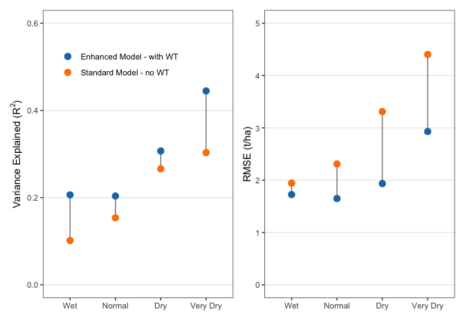

**Goal: Evaluate standard and enhanced modeled yield with SCYM satellite-derived yield observations**


**R Packages Needed**


```r
library(dplyr)
```

```
## Warning: package 'dplyr' was built under R version 4.2.3
```

```r
library(ggplot2)
library(readr)
library(earth)
library(randomForest)

library(here)
library(patchwork)
```

```
## Warning: package 'patchwork' was built under R version 4.2.3
```

```r
# load function for agreement stats
projDir <- here::here()
source(paste0(projDir,'/code/functions/funs.R'))

sessionInfo()
```

```
## R version 4.2.1 (2022-06-23)
## Platform: aarch64-apple-darwin20 (64-bit)
## Running under: macOS 14.5
## 
## Matrix products: default
## BLAS:   /Library/Frameworks/R.framework/Versions/4.2-arm64/Resources/lib/libRblas.0.dylib
## LAPACK: /Library/Frameworks/R.framework/Versions/4.2-arm64/Resources/lib/libRlapack.dylib
## 
## locale:
## [1] en_US.UTF-8/en_US.UTF-8/en_US.UTF-8/C/en_US.UTF-8/en_US.UTF-8
## 
## attached base packages:
## [1] stats     graphics  grDevices utils     datasets  methods   base     
## 
## other attached packages:
##  [1] patchwork_1.2.0      here_1.0.1           randomForest_4.7-1.1
##  [4] earth_5.3.2          plotmo_3.6.2         TeachingDemos_2.12  
##  [7] plotrix_3.8-2        Formula_1.2-4        readr_2.1.2         
## [10] ggplot2_3.4.2        dplyr_1.1.4          knitr_1.43          
## 
## loaded via a namespace (and not attached):
##  [1] pillar_1.9.0     bslib_0.5.0      compiler_4.2.1   jquerylib_0.1.4 
##  [5] tools_4.2.1      digest_0.6.33    jsonlite_1.8.7   evaluate_0.21   
##  [9] lifecycle_1.0.4  tibble_3.2.1     gtable_0.3.3     pkgconfig_2.0.3 
## [13] rlang_1.1.3      cli_3.6.2        rstudioapi_0.13  yaml_2.3.7      
## [17] xfun_0.39        fastmap_1.1.1    withr_3.0.0      generics_0.1.3  
## [21] vctrs_0.6.5      sass_0.4.7       hms_1.1.1        rprojroot_2.0.3 
## [25] grid_4.2.1       tidyselect_1.2.1 glue_1.7.0       R6_2.5.1        
## [29] fansi_1.0.6      rmarkdown_2.23   tzdb_0.3.0       magrittr_2.0.3  
## [33] scales_1.2.1     htmltools_0.5.5  ellipsis_0.3.2   colorspace_2.1-0
## [37] utf8_1.2.4       munsell_0.5.0    cachem_1.0.8
```

# Directories

To run "analysis" scripts, please download the zipped data folder at [https://zenodo.org/doi/10.5281/zenodo.13274562](https://zenodo.org/doi/10.5281/zenodo.13274562) and save to your local computer. Use the filepath to "RepoData" for the `masterDataDir` variable at the top of each analysis script in the "Directories" code chunk.


```r
# for master file
masterDataDir <- '/Users/Documents/projects/2022_compass_GLM/paper_gw_subsidy/data/RepoData'

# output folder: clean df for figures
repoDataDir <- paste0(here::here(),'/data/analysisOutput_forFigs')
```


# Load Formatted Model data

variable notes 

* when variables were named, I was dumb and didn't understand SPEI. so SPEI really means water deficit (ppt - pet))
* psim_WT_tha = yield (in t/ha) from the Enhanced Crop Model (aka, with water table = WT)
* psim_noWT_tha = yield (in t/ha) from the Standard Crop Model (aka, with no water table = noWT)
* yield_tha = SCYM satellite-derived yield observations


```r
# load enhanced model and standard model soil moisture
psim0 <- readRDS(paste0(masterDataDir,'/masterData_apsimGrid.rds'))

# add water deficit classes
psim <- psim0 %>%
  filter(!is.na(spei_ju1)) %>%
  mutate(speiJu_class2 = case_when(spei_ju1 >= 0 ~ 1,
                                spei_ju1 < 0  & spei_ju1 >= -50 ~ 2,
                                spei_ju1 < -50 & spei_ju1 >= -150 ~ 3,
                                spei_ju1 < -150 ~ 4))

# consider only grid cells with reasonable amount of corn crop cover (10%+)
psim_consensus <- psim %>% filter(scym2020_10prct == 1) %>%
  filter(!is.na(yield_tha))

table(psim_consensus$speiJu_class2)
```

```
## 
##      1      2      3      4 
##  27190  53109 119287  16608
```

# calculate agreement statistics


```r
# psim WT and scym2020
stats_a <- psim_consensus %>% 
  filter(!is.na(spei_ju1)) %>%
  group_by(speiJu_class2) %>%
  do(as.data.frame(calcStats(.$psim_WT_tha, .$yield_tha))) %>%
  ungroup()
stats_a$scymType <- 'scym2020'
stats_a$psimType <- 'Enhanced Model - with WT'

stats_b <- psim_consensus %>% 
  filter(!is.na(spei_ju1)) %>%
  group_by(speiJu_class2) %>%
  do(as.data.frame(calcStats(.$psim_noWT_tha, .$yield_tha))) %>%
  ungroup()
stats_b$scymType <- 'scym2020'
stats_b$psimType <- 'Standard Model - no WT'

stats_speiClass <- bind_rows(stats_a, stats_b)

speiAgu <- stats_speiClass %>%
  dplyr::select(speiJu_class2, r2, rmse, psimType) %>%
  mutate(speiClass = case_when(speiJu_class2 == 1 ~ 'Wet',
                               speiJu_class2 == 2 ~ 'Normal',
                               speiJu_class2 == 3 ~ 'Dry',
                               speiJu_class2 == 4 ~ 'Very Dry'))

# export df for manuscript figure
write_csv(speiAgu, paste0(repoDataDir,'/Figure2_agreementStats.csv'))
```


# Fig preview


```r
xLevels <- c('Wet','Normal','Dry','Very Dry')

p_r2<- ggplot(speiAgu %>% arrange(psimType),
       aes(x = factor(speiClass, level = xLevels), y = r2)) +
  geom_line(aes(group = speiJu_class2), col = 'gray50') +
  geom_point(aes(color = psimType),cex =3) +
  ylim(0, .6) + xlab('') + 
  labs(y = expression(paste('Variance Explained (', R^2, ')'))) +
  scale_color_manual(values = c('#1f78b4','#ff7f00' )) +
  theme_bw() + theme(legend.position = c(.4,.82),
                     legend.title = element_blank(),
                       panel.grid.major.x = element_blank(),
                     legend.background = element_blank(),
                     panel.grid.minor = element_blank()) 

p_rmse <- ggplot(speiAgu %>% arrange(psimType),
       aes(factor(speiClass, level = xLevels), y = rmse)) +
  geom_line(aes(group = speiJu_class2), col = 'gray50') +
  geom_point(aes(color = psimType),cex =3) +
  ylim(0, 5) + xlab('') + ylab('RMSE (t/ha)') +
  scale_color_manual(values = c('#1f78b4','#ff7f00' )) +
  theme_bw() + theme(legend.position = 'none',
                       panel.grid.major.x = element_blank(),
                     panel.grid.minor = element_blank()) 

p_r2 + p_rmse
```

<!-- -->


Numeric summaries


```r
nrow(psim_consensus)
```

```
## [1] 216194
```

```r
obsByYear <- psim_consensus %>%
  group_by(year) %>%
  summarize(count = n())
mean(obsByYear$count)
```

```
## [1] 10294.95
```

```r
summary(obsByYear$count)
```

```
##    Min. 1st Qu.  Median    Mean 3rd Qu.    Max. 
##    9506    9960   10268   10295   10670   10780
```

```r
# overall stats
calcStats(psim_consensus$psim_WT_tha, psim_consensus$yield_tha)
```

```
##               r2     rmse     vecv      mae     mdae         me         r
## x_pred 0.3907097 1.940974 7.114788 1.400086 1.056065 -0.2650885 0.6250677
##                m     int    rmspe
## x_pred 0.5320505 5.22891 23.31958
```

```r
calcStats(psim_consensus$psim_noWT_tha, psim_consensus$yield_tha)
```

```
##               r2     rmse      vecv      mae     mdae        me         r
## x_pred 0.3600489 3.053568 -129.8912 2.123268 1.388724 -1.490419 0.6000407
##                m      int   rmspe
## x_pred 0.3627342 7.469418 32.4853
```

```r
# stats by weather group
stats_speiClass
```

```
## # A tibble: 8 × 13
##   speiJu_class2    r2  rmse   vecv   mae  mdae     me     r     m   int rmspe
##           <dbl> <dbl> <dbl>  <dbl> <dbl> <dbl>  <dbl> <dbl> <dbl> <dbl> <dbl>
## 1             1 0.206  1.72  -31.4  1.28 1.02  -0.455 0.454 0.410  7.16  15.0
## 2             2 0.204  1.65  -28.3  1.22 0.961 -0.358 0.451 0.409  6.96  14.5
## 3             3 0.307  1.94  -26.3  1.38 1.04  -0.261 0.554 0.428  6.30  20.2
## 4             4 0.445  2.93  -14.1  2.33 2.01   0.311 0.667 0.468  3.89  55.7
## 5             1 0.102  1.94  -67.0  1.45 1.15  -0.575 0.319 0.287  8.58  16.4
## 6             2 0.154  2.31 -152.   1.62 1.17  -0.958 0.392 0.260  8.77  20.3
## 7             3 0.266  3.31 -270.   2.30 1.47  -1.77  0.516 0.272  8.37  32.9
## 8             4 0.303  4.40 -158.   3.53 2.99  -2.69  0.551 0.365  5.81  65.0
## # ℹ 2 more variables: scymType <chr>, psimType <chr>
```

```r
# improvement in rmse for very dry class (percent increase)
(1 - stats_speiClass$rmse[4]/stats_speiClass$rmse[8]) * 100
```

```
## [1] 33.46172
```

```r
# improvement in rmse for  dry class (percent increase)
(1 - stats_speiClass$rmse[3]/stats_speiClass$rmse[7]) * 100
```

```
## [1] 41.55726
```
