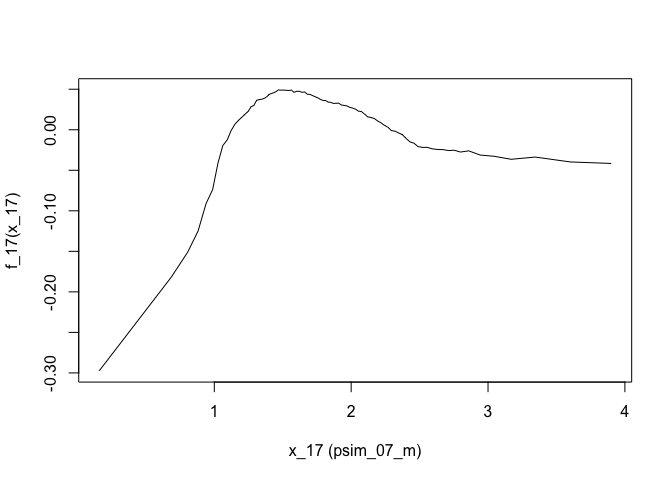
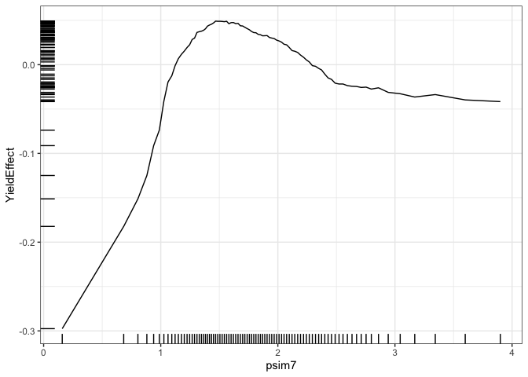
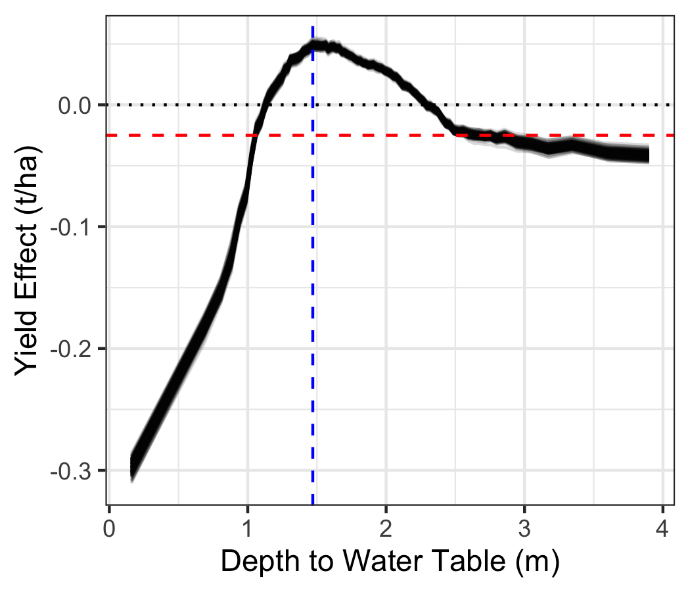
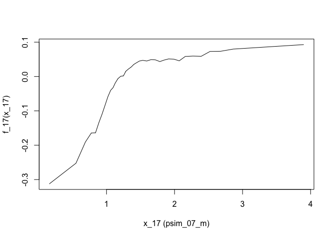
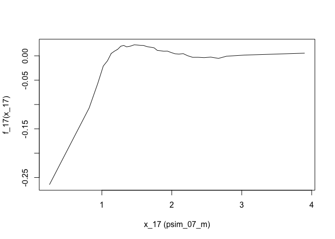
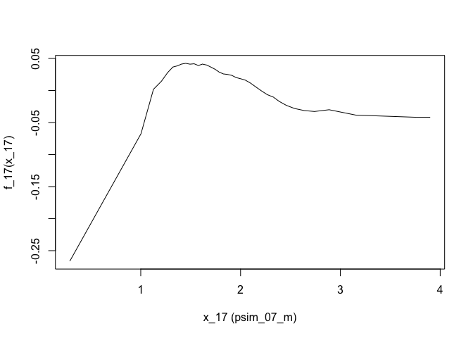
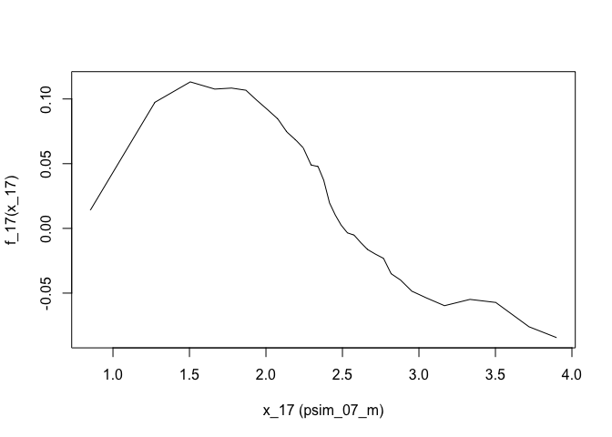
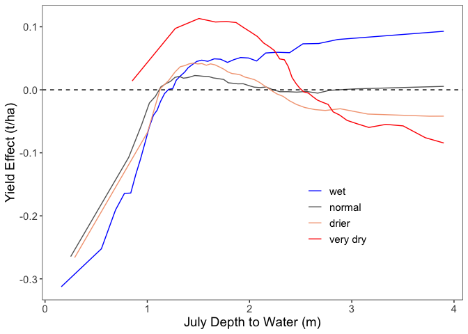
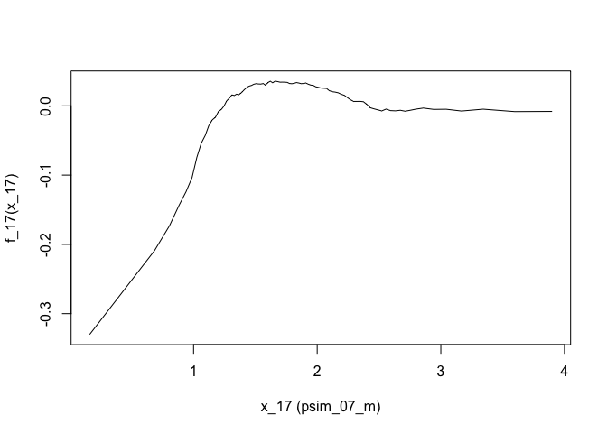
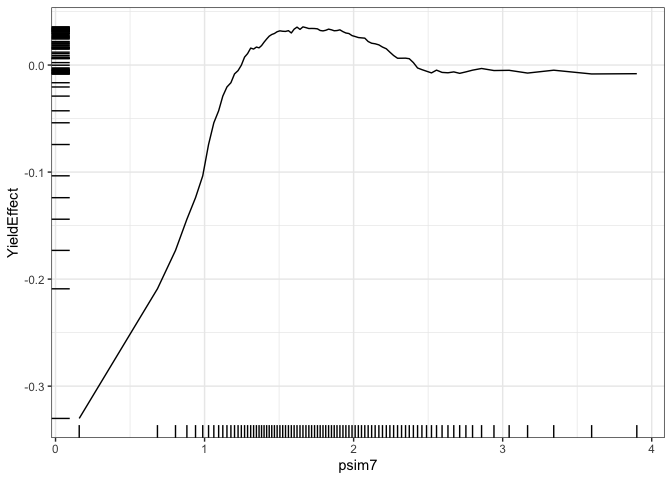

**Goal: use random forests to identify effects of WT using the SCYM yield data**

Notes: includes both standard soil moisture (top) and enhanced model soil moisture (accountingn for capillary rise/water table; below)


**R Packages Needed**


```r
library(dplyr)
```

```
## Warning: package 'dplyr' was built under R version 4.2.3
```

```r
library(ggplot2)
library(readr)
library(earth)
library(randomForest)

library(here)
library(patchwork)
```

```
## Warning: package 'patchwork' was built under R version 4.2.3
```

```r
sessionInfo()
```

```
## R version 4.2.1 (2022-06-23)
## Platform: aarch64-apple-darwin20 (64-bit)
## Running under: macOS 14.5
## 
## Matrix products: default
## BLAS:   /Library/Frameworks/R.framework/Versions/4.2-arm64/Resources/lib/libRblas.0.dylib
## LAPACK: /Library/Frameworks/R.framework/Versions/4.2-arm64/Resources/lib/libRlapack.dylib
## 
## locale:
## [1] en_US.UTF-8/en_US.UTF-8/en_US.UTF-8/C/en_US.UTF-8/en_US.UTF-8
## 
## attached base packages:
## [1] stats     graphics  grDevices utils     datasets  methods   base     
## 
## other attached packages:
##  [1] patchwork_1.2.0      here_1.0.1           randomForest_4.7-1.1
##  [4] earth_5.3.2          plotmo_3.6.2         TeachingDemos_2.12  
##  [7] plotrix_3.8-2        Formula_1.2-4        readr_2.1.2         
## [10] ggplot2_3.4.2        dplyr_1.1.4          knitr_1.43          
## 
## loaded via a namespace (and not attached):
##  [1] pillar_1.9.0     bslib_0.5.0      compiler_4.2.1   jquerylib_0.1.4 
##  [5] tools_4.2.1      digest_0.6.33    jsonlite_1.8.7   evaluate_0.21   
##  [9] lifecycle_1.0.4  tibble_3.2.1     gtable_0.3.3     pkgconfig_2.0.3 
## [13] rlang_1.1.3      cli_3.6.2        rstudioapi_0.13  yaml_2.3.7      
## [17] xfun_0.39        fastmap_1.1.1    withr_3.0.0      generics_0.1.3  
## [21] vctrs_0.6.5      sass_0.4.7       hms_1.1.1        rprojroot_2.0.3 
## [25] grid_4.2.1       tidyselect_1.2.1 glue_1.7.0       R6_2.5.1        
## [29] fansi_1.0.6      rmarkdown_2.23   tzdb_0.3.0       magrittr_2.0.3  
## [33] scales_1.2.1     htmltools_0.5.5  ellipsis_0.3.2   colorspace_2.1-0
## [37] utf8_1.2.4       munsell_0.5.0    cachem_1.0.8
```

# Directories

To run "analysis" scripts, please download the zipped data folder at [https://zenodo.org/doi/10.5281/zenodo.13274562](https://zenodo.org/doi/10.5281/zenodo.13274562) and save to your local computer. Use the filepath to "RepoData" for the `masterDataDir` variable at the top of each analysis script in the "Directories" code chunk.


```r
# for master file
masterDataDir <- '/Users/Documents/projects/2022_compass_GLM/paper_gw_subsidy/data/RepoData'

# intermediate folder for large objects (eg rf output)
scratchFolder <- paste0(masterDataDir,'/intermediates')


# output folder: clean df for figures
repoDataDir <- paste0(here::here(),'/data/analysisOutput_forFigs')
```


# functions
helper functions for processing ALEplot output


```r
library(ALEPlot)
aleToDf <- function(aleList, xname){
  df <- data.frame(xname = aleList$x.values,
                      'YieldEffect' = aleList$f.values)
  names(df)[1] <- xname
  return(df)
}

# prep prediction function for ALEplot
yhat <- function(X.model, newdata) as.numeric(predict(X.model, newdata, type = 'response'))
```

# SCYM: Standard Soil Moisture
Analysis with soil moisture from the Standard Crop Model, which captures soil moisture changes from rainfall/ET

## Variable selection

load master data file and use MARS for variable selection

note water deficit is named "spei" in the df

RUN 1X - OUTPUT STORED AS RDS FOR LATER USE


```r
master <- readRDS(paste0(masterDataDir,'/masterData_pointSample.rds'))

# identify variables to consider (listed in Table S1)

df_table1var <- master %>%
  dplyr::select(c(yield_tha, nccpi3corn, rootznaws, JJAradn, year, pr_early, pr_grow,
                  GDD_8_30, spei_ju1, spei_au2, soc0100, drclasscd, contains('tmin'),
                   contains('tmax'), contains('vpd'), contains('ppt'), tpi,  slope,
                   psim_07_m, psim_05_m, psim_06_m, psim_08_m, psim_14_m)) %>%
  tidyr::drop_na()

# mars for var selection
set.seed(5)
marsAll <- earth::earth(yield_tha ~ ., data = df_table1var, degree = 2)
summary(marsAll)
ev <- earth::evimp(marsAll) # estimate variable importance
plot(ev)
ev

saveRDS(marsAll, paste0(scratchFolder, '/marsOutput_scymDf_forVarSel.rds'))
```


## RF model
run 1x - output stored as RDS for later use

Note: July soil moisture from the Standard Crop Model is added as a variable based on helpful reviewer comments and strategy to examine direct vs soil moisture pathways for groundwater contributions


```r
# load MARS output for selected variables
marsAll <- readRDS( paste0(scratchFolder,'/marsOutput_scymDf_forVarSel.rds'))
summary(marsAll)
ev <- earth::evimp(marsAll) # estimate variable importance
plot(ev)
ev

# vector of variable names
envvars0 <- rownames(ev)[1:17]


# load master df and add in july soil moisture from psim without wt
scym_df0 <- readRDS(paste0(masterDataDir,'/masterData_pointSample.rds'))


# get apsim soil moisture: standard model
apsim_sm <- read_csv(paste0(masterDataDir,'/standardModel_JulySoilMoisture.csv'))


scym_df <- scym_df0 %>%
  left_join(apsim_sm)

# add standard model soil moistures to variable vector
envvars <- c(envvars0, 'SW1m_Jul')


# prep random forest - df with only wanted variables
df_20201  <- scym_df %>%
  dplyr::select(c(yield_tha, all_of(envvars), spei_ju1))

# run and save RF
set.seed(5)
ncols <- dim(df_20201)[2]
rf_scym20 <- randomForest(x = df_20201[,2:ncols],
                         y = df_20201$yield_tha,
                         ntree = 100,
                         importance = FALSE,
                         nodesize = 10)
rf_scym20
saveRDS(rf_scym20, paste0(scratchFolder,'/rf1_scymPointRf_marsVars_standardSoilMoisture_ns10_100t.RDS'))
```


## scym  aleplots - 


```r
# load data and intermediate model outputs --------------
marsAll <- readRDS( paste0(scratchFolder,'/marsOutput_scymDf_forVarSel.rds'))
ev <- earth::evimp(marsAll) # estimate variable importance
envvars0 <- rownames(ev)[1:17]
envvars <- c(envvars0, 'SW1m_Jul', 'spei_ju1')

# df: master plus Standard Model Soil Moisture
scym_df0 <- readRDS(paste0(masterDataDir,'/masterData_pointSample.rds')) %>% ungroup()
apsim_sm <- read_csv(paste0(masterDataDir,'/standardModel_JulySoilMoisture.csv'))
```

```
## Rows: 550946 Columns: 3
## ── Column specification ────────────────────────────────────────────────────────
## Delimiter: ","
## dbl (3): psim_id, year, SW1m_Jul
## 
## ℹ Use `spec()` to retrieve the full column specification for this data.
## ℹ Specify the column types or set `show_col_types = FALSE` to quiet this message.
```

```r
scym_df <- scym_df0 %>%
  left_join(apsim_sm)
```

```
## Joining with `by = join_by(psim_id, year)`
```

```r
mean(scym_df$yield_tha)
```

```
## [1] 10.84708
```

```r
# df
Xdat_scym  <- scym_df %>%
  dplyr::select(c(yield_tha, all_of(envvars))) %>%
  tidyr::drop_na() %>%
  as.data.frame()

# rf model
rfModel_scym <- readRDS(paste0(scratchFolder,'/rf1_scymPointRf_marsVars_standardSoilMoisture_ns10_100t.RDS'))

rfModel_scym
```

```
## 
## Call:
##  randomForest(x = df_20201[, 2:ncols], y = df_20201$yield_tha,      ntree = 100, nodesize = 10, importance = FALSE) 
##                Type of random forest: regression
##                      Number of trees: 100
## No. of variables tried at each split: 6
## 
##           Mean of squared residuals: 1.852671
##                     % Var explained: 69.45
```

```r
# ALE plot for WT variable (psim_07_m, column = J = 17)
names(Xdat_scym)
```

```
##  [1] "yield_tha"  "vpd_july"   "ppt_jun"    "year"       "tmax_aug"  
##  [6] "nccpi3corn" "pr_grow"    "ppt_may"    "tmin_jul"   "vpd_jun"   
## [11] "drclasscd"  "vpd_aug"    "JJAradn"    "tmax_may"   "rootznaws" 
## [16] "ppt_jul"    "psim_07_m"  "tmin_apr"   "SW1m_Jul"   "spei_ju1"
```

```r
ALEPlot_scym <- ALEPlot(X = Xdat_scym, X.model = rfModel_scym, J = 17, 
                        pred.fun = yhat, K = 100)
```

<!-- -->

```r
# rearrange and visualize
scymYield_df <- aleToDf(ALEPlot_scym, 'psim7') 

ggplot(scymYield_df, aes(x = psim7, y = YieldEffect)) +
  geom_line() + geom_rug() + theme_bw()
```

<!-- -->

```r
max(scymYield_df$YieldEffect)
```

```
## [1] 0.04910481
```

```r
# save data for final fig
write_csv(scymYield_df, paste0(repoDataDir,'/Fig3a_scym_yieldVsWT_aleplot_may2024_35kNoDupe_standardSoilM.csv'))
```

## BOOTSTRAP
figure S1b


```r
nsamples <- 200
n_boot <- nrow(Xdat_scym)
boots <- list()
for (i in 1:nsamples){
  # resample
  resampled <- Xdat_scym %>%
    slice_sample(n = n_boot, replace = TRUE)
  
  ale <- ALEPlot(X = resampled, X.model = rfModel_scym,
                            J = 17, pred.fun = yhat, K = 100)
  ale_df <- aleToDf(ale, 'psim7') 
  
  df_out <- ale_df %>% mutate(bootN = i)
  
  boots[[i]] <- df_out
}


allBoots <- do.call('rbind', boots)

ggplot(allBoots,
       aes(x = psim7, y = YieldEffect, group = as.factor(bootN), color =  bootN)) +
  geom_line() + theme_bw() + scale_color_viridis_c()


# save data for final fig
write_csv(allBoots, paste0(repoDataDir,'/Fig3a_Bootstrap_',nsamples,
                           '_may2024_standardSoilM.csv'))
```

### analyze bootstrap

```r
nsamples <- 200
allBoots <- read_csv(paste0(repoDataDir,'/Fig3a_Bootstrap_',nsamples,
                           '_may2024_standardSoilM.csv'))
```

```
## Rows: 17800 Columns: 3
## ── Column specification ────────────────────────────────────────────────────────
## Delimiter: ","
## dbl (3): psim7, YieldEffect, bootN
## 
## ℹ Use `spec()` to retrieve the full column specification for this data.
## ℹ Specify the column types or set `show_col_types = FALSE` to quiet this message.
```

```r
p_bootStrap <- ggplot(allBoots,
       aes(x = psim7, y = YieldEffect, group = as.factor(bootN))) +
  geom_line(alpha = .15) + 
  geom_hline(yintercept = -0.025, linetype = 'dashed', color = 'red') +
    geom_vline(xintercept = 1.47, linetype = 'dashed', color = 'blue') +
   # geom_hline(yintercept = .05) +
      geom_hline(yintercept = 0, linetype = 'dotted') +
  theme_bw() + xlab('Depth to Water Table (m)') + ylab('Yield Effect (t/ha)') +
  scale_color_viridis_c()
p_bootStrap
```

<!-- -->

```r
# get maxima
boot_max <- allBoots %>%
  group_by(bootN) %>%
  slice_max(YieldEffect) %>%
  mutate(effectSize = YieldEffect + 0.025)
quantile(boot_max$effectSize, c(.025, .975)) 
```

```
##       2.5%      97.5% 
## 0.07118019 0.07765380
```


## Figure 3d: wt by spei scym


```r
#  by climate ---------------------
Xdat3 <- Xdat_scym %>%
  mutate(spei_tile = ntile(spei_ju1, 5),
         vpd_tile = ntile(vpd_july, 5),
        speiJu_class = case_when(spei_ju1 >= 0 ~ 1,
                                spei_ju1 < 0  & spei_ju1 >= -50 ~ 2,
                                spei_ju1 < -50 & spei_ju1 >= -150 ~ 3,
                                spei_ju1 < -150 ~ 4)) %>%
  mutate(speiClass = case_when(speiJu_class == 1 ~ 'wet',
                               speiJu_class == 2 ~ 'normal',
                               speiJu_class == 3 ~ 'dry',
                               speiJu_class == 4 ~ 'very dry'),
         gwClass = case_when(psim_07_m < 1.1 ~ 1,
                             psim_07_m >= 1.1 & psim_07_m <2.5 ~ 2,
                             psim_07_m >=2.5 ~ 3),
         yearGroup = case_when(year < 2009 ~ 1,
                               year >= 2009 ~ 2))

# mean yield in dry
table(Xdat3$speiJu_class)
```

```
## 
##      1      2      3      4 
##  82262 158771 362580  56920
```

```r
veryDry <- Xdat3 %>% filter(speiJu_class == 4)
summary(veryDry$yield_tha)
```

```
##    Min. 1st Qu.  Median    Mean 3rd Qu.    Max. 
##   1.005   5.340   7.595   7.498   9.625  18.965
```

```r
names(Xdat3)
```

```
##  [1] "yield_tha"    "vpd_july"     "ppt_jun"      "year"         "tmax_aug"    
##  [6] "nccpi3corn"   "pr_grow"      "ppt_may"      "tmin_jul"     "vpd_jun"     
## [11] "drclasscd"    "vpd_aug"      "JJAradn"      "tmax_may"     "rootznaws"   
## [16] "ppt_jul"      "psim_07_m"    "tmin_apr"     "SW1m_Jul"     "spei_ju1"    
## [21] "spei_tile"    "vpd_tile"     "speiJu_class" "speiClass"    "gwClass"     
## [26] "yearGroup"
```

```r
psim_speiList <- list()
for(i in 1:4) {
  y <- i
  df_year <- Xdat3 %>% filter(speiJu_class == y)
  ale_year <- aleToDf(ALEPlot(X = df_year, X.model = rfModel_scym, J = 17, pred.fun = yhat, K = 40), 'psim_07_m')
  ale_year$speiJu_class <- y
  psim_speiList[[i]] <- ale_year
}
```

<!-- --><!-- --><!-- --><!-- -->

```r
psim_spei <- do.call('rbind', psim_speiList)


# save data for final fig
write_csv(psim_spei, paste0(repoDataDir,'/Fig3d_scym_yieldVsWT_byPPET_aleplot_oct23_35knoDupe.csv'))


aguP <- ggplot(psim_spei,
       aes(x = psim_07_m, y = YieldEffect, group = as.factor(speiJu_class), 
           color =  as.factor(speiJu_class))) +
  geom_line() + 
    geom_hline(yintercept = 0, linetype = 'dashed') +
  scale_color_manual(values = c('blue','gray40','#f4a582','red'),
                     labels = c('wet','normal','drier','very dry')) +
  ylab('Yield Effect (t/ha)') + xlab('July Depth to Water (m)') +
  theme_bw() +  theme(legend.title = element_blank(),
                      legend.position = c(.7,.3),
                      panel.grid.major.x = element_blank(),
                      panel.grid.major.y = element_blank(),
                     panel.grid.minor.y = element_blank(),
                      panel.grid.minor.x = element_blank(),
                     text = element_text(size = 14)) 
aguP
```

<!-- -->


# SCYM: Enhanced Soil Moisture
Analysis with soil moisture from the Enhanced Crop Model, which captures soil moisture changes from rainfall/ET + from the water table/capillary rise

## RF Model: Enhanced sm


```r
# load MARS output for selected variables
marsAll <- readRDS( paste0(scratchFolder,'/marsOutput_scymDf_forVarSel.rds'))
summary(marsAll)
ev <- earth::evimp(marsAll) # estimate variable importance
plot(ev)
ev

# vector of variable names
envvars0 <- rownames(ev)[1:17]

# load master df and add in july soil moisture from psim without wt
scym_df0 <- readRDS(paste0(masterDataDir,'/masterData_pointSample.rds'))

# get apsim soil moisture: standard model
apsim_sm <- read_csv(paste0(masterDataDir,'/enhancedModel_JulySoilMoisture.csv'))

scym_dfb <- scym_df0 %>%
  left_join(apsim_sm)

# add standard model soil moistures to variable vector
envvars <- c(envvars0, 'SW1m_Jul')


# prep random forest - df with only wanted variables
df_20201b  <- scym_dfb %>%
  dplyr::select(c(yield_tha, all_of(envvars), spei_ju1))

# run and save RF
set.seed(5)
ncols <- dim(df_20201b)[2]
rf_scym20b <- randomForest(x = df_20201b[,2:ncols],
                         y = df_20201b$yield_tha,
                         ntree = 100,
                         importance = FALSE,
                         nodesize = 10)
rf_scym20b
saveRDS(rf_scym20b, paste0(scratchFolder,'/rf1_scymPointRf_marsVars_enhancedSoilMoisture_ns10_100t.RDS'))
```

## Scym aleplots: Enhanced sm


```r
# load data and intermediate model outputs --------------
marsAll <- readRDS( paste0(scratchFolder,'/marsOutput_scymDf_forVarSel.rds'))
ev <- earth::evimp(marsAll) # estimate variable importance
envvars0 <- rownames(ev)[1:17]
envvars <- c(envvars0, 'SW1m_Jul', 'spei_ju1')

# df: master plus Standard Model Soil Moisture
scym_df0 <- readRDS(paste0(masterDataDir,'/masterData_pointSample.rds')) %>% ungroup()
apsim_sm2 <- read_csv(paste0(masterDataDir,'/enhancedModel_JulySoilMoisture.csv'))
```

```
## Rows: 550946 Columns: 3
## ── Column specification ────────────────────────────────────────────────────────
## Delimiter: ","
## dbl (3): psim_id, year, SW1m_Jul
## 
## ℹ Use `spec()` to retrieve the full column specification for this data.
## ℹ Specify the column types or set `show_col_types = FALSE` to quiet this message.
```

```r
scym_dfb <- scym_df0 %>%
  left_join(apsim_sm2)
```

```
## Joining with `by = join_by(psim_id, year)`
```

```r
# df
Xdat_scymb  <- scym_dfb %>%
  dplyr::select(c(yield_tha, all_of(envvars))) %>%
  tidyr::drop_na() %>%
  as.data.frame()

# rf model
rfModel_scymb <- readRDS(paste0(scratchFolder,'/rf1_scymPointRf_marsVars_enhancedSoilMoisture_ns10_100t.RDS'))

rfModel_scymb
```

```
## 
## Call:
##  randomForest(x = df_20201[, 2:ncols], y = df_20201$yield_tha,      ntree = 100, nodesize = 10, importance = FALSE) 
##                Type of random forest: regression
##                      Number of trees: 100
## No. of variables tried at each split: 6
## 
##           Mean of squared residuals: 1.853101
##                     % Var explained: 69.44
```

```r
# ALE plot for WT variable (psim_07_m, column = J = 17)
names(Xdat_scymb)
```

```
##  [1] "yield_tha"  "vpd_july"   "ppt_jun"    "year"       "tmax_aug"  
##  [6] "nccpi3corn" "pr_grow"    "ppt_may"    "tmin_jul"   "vpd_jun"   
## [11] "drclasscd"  "vpd_aug"    "JJAradn"    "tmax_may"   "rootznaws" 
## [16] "ppt_jul"    "psim_07_m"  "tmin_apr"   "SW1m_Jul"   "spei_ju1"
```

```r
ALEPlot_scymb <- ALEPlot(X = Xdat_scymb, X.model = rfModel_scymb, J = 17, 
                        pred.fun = yhat, K = 100)
```

<!-- -->

```r
# rearrange and visualize
scymYield_dfb <- aleToDf(ALEPlot_scymb, 'psim7') 

ggplot(scymYield_dfb, aes(x = psim7, y = YieldEffect)) +
  geom_line() + geom_rug() + theme_bw()
```

<!-- -->

```r
max(scymYield_dfb$YieldEffect)
```

```
## [1] 0.03565027
```

```r
# # save data for final fig
# write_csv(scymYield_dfb, paste0(repoDataDir,'/Fig3a_scym_yieldVsWT_aleplot_may2024_35kNoDupe_EnhancedSoilM.csv'))
```

