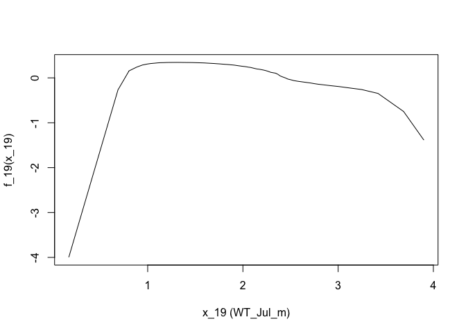

**Goal: use random forests to identify effects of WT using the modeled yield data**

Includes the sensitivity analysis/noisey simulations addition


**R Packages Needed**


```r
library(dplyr)
```

```
## Warning: package 'dplyr' was built under R version 4.2.3
```

```r
library(ggplot2)
library(readr)
library(earth)
library(randomForest)

library(here)
library(patchwork)
```

```
## Warning: package 'patchwork' was built under R version 4.2.3
```

```r
sessionInfo()
```

```
## R version 4.2.1 (2022-06-23)
## Platform: aarch64-apple-darwin20 (64-bit)
## Running under: macOS 14.5
## 
## Matrix products: default
## BLAS:   /Library/Frameworks/R.framework/Versions/4.2-arm64/Resources/lib/libRblas.0.dylib
## LAPACK: /Library/Frameworks/R.framework/Versions/4.2-arm64/Resources/lib/libRlapack.dylib
## 
## locale:
## [1] en_US.UTF-8/en_US.UTF-8/en_US.UTF-8/C/en_US.UTF-8/en_US.UTF-8
## 
## attached base packages:
## [1] stats     graphics  grDevices utils     datasets  methods   base     
## 
## other attached packages:
##  [1] patchwork_1.2.0      here_1.0.1           randomForest_4.7-1.1
##  [4] earth_5.3.2          plotmo_3.6.2         TeachingDemos_2.12  
##  [7] plotrix_3.8-2        Formula_1.2-4        readr_2.1.2         
## [10] ggplot2_3.4.2        dplyr_1.1.4          knitr_1.43          
## 
## loaded via a namespace (and not attached):
##  [1] pillar_1.9.0     bslib_0.5.0      compiler_4.2.1   jquerylib_0.1.4 
##  [5] tools_4.2.1      digest_0.6.33    jsonlite_1.8.7   evaluate_0.21   
##  [9] lifecycle_1.0.4  tibble_3.2.1     gtable_0.3.3     pkgconfig_2.0.3 
## [13] rlang_1.1.3      cli_3.6.2        rstudioapi_0.13  yaml_2.3.7      
## [17] xfun_0.39        fastmap_1.1.1    withr_3.0.0      generics_0.1.3  
## [21] vctrs_0.6.5      sass_0.4.7       hms_1.1.1        rprojroot_2.0.3 
## [25] grid_4.2.1       tidyselect_1.2.1 glue_1.7.0       R6_2.5.1        
## [29] fansi_1.0.6      rmarkdown_2.23   tzdb_0.3.0       magrittr_2.0.3  
## [33] scales_1.2.1     htmltools_0.5.5  ellipsis_0.3.2   colorspace_2.1-0
## [37] utf8_1.2.4       munsell_0.5.0    cachem_1.0.8
```

# Directories


```r
# for master file
masterDataDir <- '/Users/dein121/Library/CloudStorage/OneDrive-PNNL/Documents/projects/2022_compass_GLM/paper_gw_subsidy/data/RepoData'

# intermediate folder for large objects (eg rf output)
scratchFolder <- paste0(masterDataDir,'/intermediates')
# make scratch folder if necessary
dir.create(file.path(scratchFolder), showWarnings = FALSE)

# output folder: clean df for figures
repoDataDir <- paste0(here::here(),'/data/analysisOutput_forFigs')
```

# functions
helper functions for processing ALEplot output


```r
library(ALEPlot)
aleToDf <- function(aleList, xname){
  df <- data.frame(xname = aleList$x.values,
                      'YieldEffect' = aleList$f.values)
  names(df)[1] <- xname
  return(df)
}

# prep prediction function for ALEplot
yhat <- function(X.model, newdata) as.numeric(predict(X.model, newdata, type = 'response'))

# for checking correlated variables
calcStats <- function(x_pred1, y_obs1){
  df <- data.frame(x_pred = x_pred1,
                   y_obs = y_obs1)
  # run a lm
  lm1 <- lm(y_obs ~ x_pred, data = df)

  # stats
  r2 <- summary(lm1)$r.squared
  rmse <- sqrt(mean((df$y_obs - df$x_pred)^2, na.rm = T))
  r <- cor(df$y_obs, df$x_pred)
  m <- coef(lm1)[2]
  int <- coef(lm1)[1]
  rmspe <- sqrt(mean(((df$y_obs - df$x_pred)/df$y_obs)^2))*100
  vecv <- (1 - sum((df$y_obs - df$x_pred)^2)/sum((df$y_obs - mean(df$y_obs))^2)) * 100
  mae <- sum(abs(df$y_obs-df$x_pred),na.rm = T)/nrow(df)
  mdae <- median(abs(df$y_obs-df$x_pred))
  me <- mean(df$x_pred-df$y_obs)

  # package into df
  outdf <- data.frame(r2 = r2, rmse = rmse, vecv = vecv, mae = mae, mdae = mdae, me = me,
                      r = r, m = m, int = int,
                      rmspe = rmspe)
  return(outdf)
}
```


# Crop Model (Enhanced with WT) model
with soil moisture from standard model

## random forest
run 1x and save output for later


```r
# load enhanced model and standard model soil moisture
psimDiffs0 <- readRDS(paste0(masterDataDir,'/masterData_apsimGrid.rds'))
apsim_sm <- read_csv(paste0(masterDataDir,'/standardModel_JulySoilMoisture.csv'))

# filter years: same years as scym
psim <- psimDiffs0 %>% filter(year < 2019 & scym2020_10prct == 1) %>%
  dplyr::select(-contains('SW1')) %>% 
  left_join(apsim_sm)

# load MARS output for selected variables
marsAll <- readRDS( paste0(scratchFolder,'/marsOutput_scymDf_forVarSel.rds'))
ev <- earth::evimp(marsAll) # estimate variable importance
varsWanted <- rownames(ev)[1:17]
varsWanted2 <- varsWanted[!grepl('psim_07_m',varsWanted)]
varsWanted3 <- c(varsWanted2, 'WT_Jul_m','spei_ju1','SW1m_Jul')

# prep df for rf (enhanced model yield = psim_WT_tha)
psim_df  <- psim %>%
  dplyr::select(c(psim_WT_tha, all_of(varsWanted3) )) %>% tidyr::drop_na()
nrow(psim_df)

set.seed(5)
ncols <- dim(psim_df)[2]
rf_psim <- randomForest(x = psim_df[,2:ncols],
                         y = psim_df$psim_WT_tha,
                         ntree = 100,
                         importance = FALSE,
                        nodesize = 10)
rf_psim
saveRDS(rf_psim, paste0(scratchFolder,'/rf1_apsimGrid_marsVars_spei_WT_ns10_t100_May2024_standardSoilM.RDS'))
```

## psim ale plots


```r
# load enhanced model and standard model soil moisture
psimDiffs0 <- readRDS(paste0(masterDataDir,'/masterData_apsimGrid.rds'))
apsim_sm <- read_csv(paste0(masterDataDir,'/standardModel_JulySoilMoisture.csv'))
```

```
## Rows: 550946 Columns: 3
## ── Column specification ────────────────────────────────────────────────────────
## Delimiter: ","
## dbl (3): psim_id, year, SW1m_Jul
## 
## ℹ Use `spec()` to retrieve the full column specification for this data.
## ℹ Specify the column types or set `show_col_types = FALSE` to quiet this message.
```

```r
# filter years: same years as scym
psim <- psimDiffs0 %>% filter(year < 2019 & scym2020_10prct == 1) %>%
  dplyr::select(-contains('SW1')) %>% 
  left_join(apsim_sm)
```

```
## Joining with `by = join_by(psim_id, year)`
```

```r
# load MARS output for selected variables
marsAll <- readRDS( paste0(scratchFolder,'/marsOutput_scymDf_forVarSel.rds'))
ev <- earth::evimp(marsAll) # estimate variable importance
varsWanted <- rownames(ev)[1:17]
varsWanted2 <- varsWanted[!grepl('psim_07_m',varsWanted)]
varsWanted3 <- c(varsWanted2, 'WT_Jul_m','spei_ju1','SW1m_Jul')

# trim df for ale plot use
Xdat <- psim %>%
  dplyr::select(c(psim_WT_tha, psim_noWT_tha, all_of(varsWanted3) )) %>%
  tidyr::drop_na() %>%
  as.data.frame()

# model
rfModel <- readRDS( paste0(scratchFolder,'/rf1_apsimGrid_marsVars_spei_WT_ns10_t100_May2024_standardSoilM.RDS'))
rfModel
```

```
## 
## Call:
##  randomForest(x = psim_df[, 2:ncols], y = psim_df$psim_WT_tha,      ntree = 100, nodesize = 10, importance = FALSE) 
##                Type of random forest: regression
##                      Number of trees: 100
## No. of variables tried at each split: 6
## 
##           Mean of squared residuals: 0.4409542
##                     % Var explained: 92.37
```

```r
names(Xdat)
```

```
##  [1] "psim_WT_tha"   "psim_noWT_tha" "vpd_july"      "ppt_jun"      
##  [5] "year"          "tmax_aug"      "nccpi3corn"    "pr_grow"      
##  [9] "ppt_may"       "tmin_jul"      "vpd_jun"       "drclasscd"    
## [13] "vpd_aug"       "JJAradn"       "tmax_may"      "rootznaws"    
## [17] "ppt_jul"       "tmin_apr"      "WT_Jul_m"      "spei_ju1"     
## [21] "SW1m_Jul"
```

```r
# psim - change with WT
ALEPlot_psim <- ALEPlot(X = Xdat, X.model = rfModel, J = 19, pred.fun = yhat, K = 100)
```

<!-- -->

```r
psimYield_df <- aleToDf(ALEPlot_psim, 'psim7')


write_csv(psimYield_df,paste0(repoDataDir,'/Fig3b_psim_yieldVsWT_aleplot_may2024_standardSoilM.csv'))
```


# Noisey simulation

based on these stack exchange posts 
* https://stats.stackexchange.com/questions/15011/generate-a-random-variable-with-a-defined-correlation-to-an-existing-variables.  
* and subsequent like https://stats.stackexchange.com/questions/38856/how-to-generate-correlated-random-numbers-given-means-variances-and-degree-of

Note: "deep" points at 4m mess up the correlation and are removed for this analysis

## generate noisy data


```r
psim %>%
  filter(WT_Jul_m < 3.9) %>%
  summarize(meanWT = mean(WT_Jul_m),
            stdev = sd(WT_Jul_m))
```

```
## # A tibble: 1 × 2
##   meanWT stdev
##    <dbl> <dbl>
## 1   1.90 0.630
```

```r
# add noise to wt data with correlation specified
# stack function 1
correlatedValue = function(x, r){
  r2 = r**2
  ve = 1-r2
  SD = sqrt(ve)
  e  = rnorm(length(x), mean=0, sd=SD)
  y  = r*x + e
  
  obsMean = mean(y)
  y2 = y - obsMean
  y2b = y2 * .6
  yOut = y2b + 1.9
  return(yOut)
}

# make correlated variable
psimShallow <- psim %>% filter(WT_Jul_m < 3.9) 
nrow(psim)
```

```
## [1] 205443
```

```r
nrow(psimShallow)
```

```
## [1] 179670
```

```r
psimShallow_df  <- psimShallow %>%
  dplyr::select(c(psim_WT_tha, all_of(varsWanted3) )) %>% tidyr::drop_na()

# function doesn't translate directly and has randomness - check values 
# that produce desired correlation; saved due to stochasticity

# psim_corVar_shallow <- psimShallow_df %>%
#   mutate(WT_Jul_cor40 = correlatedValue(WT_Jul_m, .57),
#          WT_Jul_cor50 = correlatedValue(WT_Jul_m,  .675),
#          WT_Jul_cor60 = correlatedValue(WT_Jul_m,  .76),
#          WT_Jul_cor70 = correlatedValue(WT_Jul_m,  .84),
#          WT_Jul_cor80 = correlatedValue(WT_Jul_m,  .9),
#          WT_psim = WT_Jul_m) %>%
#   rename(WT_Jul_cor100 = WT_Jul_m) %>%
#   tidyr::gather(., key = corrLevel, value = WT_Jul_m, contains('_cor')) 

psim_corVar_shallow <- read_csv(paste0(scratchFolder,'/df_corrVar_psim_WT_202405.csv'))
```

```
## Rows: 1024332 Columns: 22
## ── Column specification ────────────────────────────────────────────────────────
## Delimiter: ","
## chr  (1): corrLevel
## dbl (21): psim_WT_tha, vpd_july, ppt_jun, year, tmax_aug, nccpi3corn, pr_gro...
## 
## ℹ Use `spec()` to retrieve the full column specification for this data.
## ℹ Specify the column types or set `show_col_types = FALSE` to quiet this message.
```

```r
corAgreement <- psim_corVar_shallow %>%
  group_by(corrLevel) %>%
  do(as.data.frame(calcStats(.$WT_Jul_m, .$WT_psim))) %>%
  dplyr::select(corrLevel, r)
corAgreement
```

```
## # A tibble: 6 × 2
## # Groups:   corrLevel [6]
##   corrLevel         r
##   <chr>         <dbl>
## 1 WT_Jul_cor100 1    
## 2 WT_Jul_cor40  0.402
## 3 WT_Jul_cor50  0.504
## 4 WT_Jul_cor60  0.594
## 5 WT_Jul_cor70  0.700
## 6 WT_Jul_cor80  0.794
```

## run rf analysis on noisy data


```r
psim_df1 <- psim_corVar_shallow %>% 
  dplyr::select(-c(WT_psim)) %>%
  filter(corrLevel == 'WT_Jul_cor60') %>%
  dplyr::select(-corrLevel)

set.seed(5)

ncols <- dim(psim_df1)[2]
rf_psim <- randomForest(x = psim_df1[,2:ncols],
                         y = psim_df1$psim_WT_tha,
                         ntree = 50,
                         importance = FALSE,
                        nodesize = 10)
rf_psim
saveRDS(rf_psim, paste0(scratchFolder,'/corrVar_psim_WT_ns10_t100_marsVars_noDeep_may24_WT_Jul_cor60.RDS'))
```

## noise ale plot


```r
Xdat <- psim_corVar_shallow %>% 
  dplyr::select(-c(WT_psim)) %>%
  filter(corrLevel == 'WT_Jul_cor60') %>%
  dplyr::select(-c(psim_WT_tha, corrLevel)) %>%
  as.data.frame()

rfModel <- readRDS(paste0(scratchFolder,'/corrVar_psim_WT_ns10_t100_marsVars_noDeep_may24_WT_Jul_cor60.RDS'))

names(Xdat)
```

```
##  [1] "vpd_july"   "ppt_jun"    "year"       "tmax_aug"   "nccpi3corn"
##  [6] "pr_grow"    "ppt_may"    "tmin_jul"   "vpd_jun"    "drclasscd" 
## [11] "vpd_aug"    "JJAradn"    "tmax_may"   "rootznaws"  "ppt_jul"   
## [16] "tmin_apr"   "spei_ju1"   "SW1m_Jul"   "WT_Jul_m"
```

```r
# psim - change with WT
ALEPlot_psim <- ALEPlot(X = Xdat, X.model = rfModel, J = 19, pred.fun = yhat, K = 100)
```

<!-- -->

```r
psimYield_df <- aleToDf(ALEPlot_psim, 'psim7') 

write_csv(psimYield_df, paste0(repoDataDir,'/Fig3b_psims_SA_noDeep_may24_cor60.csv'))  
```


