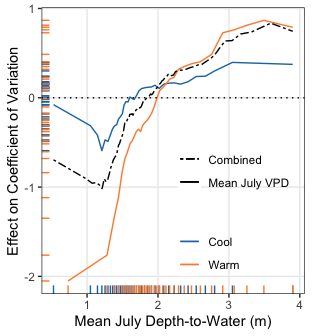

**Goal: assess stability and export data for fig 3c**


**R Packages Needed**


```r
library(dplyr)
```

```
## Warning: package 'dplyr' was built under R version 4.2.3
```

```r
library(readr)
library(ggplot2)
library(tidyr)
library(sf)


library(randomForest)
library(ALEPlot)


sessionInfo()
```

```
## R version 4.2.1 (2022-06-23)
## Platform: aarch64-apple-darwin20 (64-bit)
## Running under: macOS 14.5
## 
## Matrix products: default
## BLAS:   /Library/Frameworks/R.framework/Versions/4.2-arm64/Resources/lib/libRblas.0.dylib
## LAPACK: /Library/Frameworks/R.framework/Versions/4.2-arm64/Resources/lib/libRlapack.dylib
## 
## locale:
## [1] en_US.UTF-8/en_US.UTF-8/en_US.UTF-8/C/en_US.UTF-8/en_US.UTF-8
## 
## attached base packages:
## [1] stats     graphics  grDevices utils     datasets  methods   base     
## 
## other attached packages:
## [1] ALEPlot_1.1          randomForest_4.7-1.1 sf_1.0-14           
## [4] tidyr_1.3.0          ggplot2_3.4.2        readr_2.1.2         
## [7] dplyr_1.1.4          knitr_1.43          
## 
## loaded via a namespace (and not attached):
##  [1] Rcpp_1.0.10        pillar_1.9.0       bslib_0.5.0        compiler_4.2.1    
##  [5] jquerylib_0.1.4    class_7.3-20       tools_4.2.1        digest_0.6.33     
##  [9] yaImpute_1.0-33    jsonlite_1.8.7     evaluate_0.21      lifecycle_1.0.4   
## [13] tibble_3.2.1       gtable_0.3.3       pkgconfig_2.0.3    rlang_1.1.3       
## [17] DBI_1.1.3          cli_3.6.2          rstudioapi_0.13    yaml_2.3.7        
## [21] xfun_0.39          fastmap_1.1.1      e1071_1.7-11       withr_3.0.0       
## [25] generics_0.1.3     vctrs_0.6.5        sass_0.4.7         hms_1.1.1         
## [29] classInt_0.4-7     grid_4.2.1         tidyselect_1.2.1   glue_1.7.0        
## [33] R6_2.5.1           fansi_1.0.6        rmarkdown_2.23     purrr_1.0.1       
## [37] tzdb_0.3.0         magrittr_2.0.3     units_0.8-0        scales_1.2.1      
## [41] htmltools_0.5.5    ellipsis_0.3.2     colorspace_2.1-0   KernSmooth_2.23-20
## [45] utf8_1.2.4         proxy_0.4-27       munsell_0.5.0      cachem_1.0.8
```

# Directories

To run "analysis" scripts, please download the zipped data folder at [https://zenodo.org/doi/10.5281/zenodo.13274562](https://zenodo.org/doi/10.5281/zenodo.13274562) and save to your local computer. Use the filepath to "RepoData" for the `masterDataDir` variable at the top of each analysis script in the "Directories" code chunk.


```r
# for master file
masterDataDir <- '/Users/Documents/projects/2022_compass_GLM/paper_gw_subsidy/data/RepoData'

# intermediate folder for large objects (eg rf output)
scratchFolder <- paste0(masterDataDir,'/intermediates')


# output folder: clean df for figures
repoDataDir <- paste0(here::here(),'/data/analysisOutput_forFigs')
```


# functions
helper functions for processing ALEplot output


```r
library(ALEPlot)
aleToDf <- function(aleList, xname){
  df <- data.frame(xname = aleList$x.values,
                      'Effect' = aleList$f.values)
  names(df)[1] <- xname
  return(df)
}

# prep prediction function for ALEplot
yhat <- function(X.model, newdata) as.numeric(predict(X.model, newdata, type = 'response'))
```

# SCYM - points

## load scym


```r
# load data and add in soil moisture
scym <-  readRDS(paste0(masterDataDir,'/masterData_pointSample.rds'))
apsim_sm <- read_csv(paste0(masterDataDir,'/standardModel_JulySoilMoisture.csv'))
```

```
## Rows: 550946 Columns: 3
## ── Column specification ────────────────────────────────────────────────────────
## Delimiter: ","
## dbl (3): psim_id, year, SW1m_Jul
## 
## ℹ Use `spec()` to retrieve the full column specification for this data.
## ℹ Specify the column types or set `show_col_types = FALSE` to quiet this message.
```

```r
scym2 <- scym %>%
  left_join(apsim_sm)
```

```
## Joining with `by = join_by(psim_id, year)`
```

```r
# extract static attributes for each location
ptAttributes <- scym %>% 
  group_by(geom_id) %>% 
  slice(1) %>% 
  dplyr::select(c(geom_id, psim_id, gridID, fips5, state, ASD, latitude, longitude,
                  agtile, drclasscd, droughty, mukey_30m,  nccpi3corn, pwsl1pomu,
                  rootznaws, soc0100, ted, slope,  tpi, TPIclass, TPIclass2))

checkCounts<- scym %>%
  group_by(geom_id) %>%
  summarize(count = n()) %>%
  arrange(-count)
summary(checkCounts$count)
```

```
##    Min. 1st Qu.  Median    Mean 3rd Qu.    Max. 
##   1.000   4.000   5.000   5.114   6.000  16.000
```

```r
# calculate stability
stability <- scym2 %>%
  group_by(geom_id) %>%
  summarize(meanYield = mean(yield_tha),
            stdevYield = sd(yield_tha),
            sd_detrend = sd(yield_scym20_pixelDe),
            meanWT_jul = mean(psim_07_m),
            meanWT_jun = mean(psim_06_m),
            meanWT_may = mean(psim_05_m),
            meanVPD = mean(vpd_july),
            meanPpt = mean(pr_grow),
            meanAugTmax = mean(Augmaxt),
            meanRad = mean(JJAradn),
            meanPpt_early = mean(pr_early),
            meanSW_jul = mean(SW1m_Jul)) %>%
  left_join(ptAttributes)
```

```
## Joining with `by = join_by(geom_id)`
```

```r
# make some classifications
stability2 <- stability %>%
  mutate(yield_tile3 = ntile(meanYield, 3),
         vpd_tile3 = ntile(meanVPD,3),
         soil_tile3 = ntile(rootznaws,3),
         sd_mean = stdevYield/meanYield,
         cv = sd_mean * 100)

summary(stability2$cv)
```

```
##    Min. 1st Qu.  Median    Mean 3rd Qu.    Max.    NA's 
##    0.00   11.51   16.25   18.27   22.59  118.31    1888
```


## model with RF
use RF and ALE to isolate the effects of gw

### use cv yields


```r
scym_df  <- stability2 %>%
  dplyr::select(-c(geom_id, latitude, longitude, stdevYield, sd_detrend,
                   meanYield,
                   ted, agtile, contains('tile'), sd_mean, slope,
                   pwsl1pomu, mukey_30m, droughty, drclasscd, tpi, ASD,
                   state, fips5, psim_id, gridID, TPIclass, TPIclass2)) %>% 
  dplyr::select(cv, everything()) %>% tidyr::drop_na()


set.seed(5)
ncols <- dim(scym_df)[2]
rf_scym <- randomForest(x = scym_df[,2:ncols],
                         y = scym_df$cv,
                         ntree = 100,
                         importance = TRUE)
rf_scym
varImpPlot(rf_scym)

saveRDS(rf_scym, paste0(scratchFolder,'/stability_checkRf_coefVar_20230815_may24.RDS'))
```

## evaluate 

### cv


```r
scym_df  <- stability2 %>%
  dplyr::select(-c(geom_id, latitude, longitude, stdevYield, sd_detrend,
                   meanYield,
                   ted, agtile, contains('tile'), sd_mean, slope,
                   pwsl1pomu, mukey_30m, droughty, drclasscd, tpi, ASD,
                   state, fips5, psim_id, gridID, TPIclass, TPIclass2)) %>% 
  dplyr::select(cv, everything()) %>% tidyr::drop_na()

rf_scym <- readRDS(paste0(scratchFolder,'/stability_checkRf_coefVar_20230815_may24.RDS'))
rf_scym
```

```
## 
## Call:
##  randomForest(x = scym_df[, 2:ncols], y = scym_df$cv, ntree = 100,      importance = TRUE) 
##                Type of random forest: regression
##                      Number of trees: 100
## No. of variables tried at each split: 4
## 
##           Mean of squared residuals: 52.1461
##                     % Var explained: 50.12
```

```r
varImpPlot(rf_scym)
```

<!-- -->

```r
# ale 
Xdat <- scym_df %>% as.data.frame()
names(Xdat)
```

```
##  [1] "cv"            "meanWT_jul"    "meanWT_jun"    "meanWT_may"   
##  [5] "meanVPD"       "meanPpt"       "meanAugTmax"   "meanRad"      
##  [9] "meanPpt_early" "meanSW_jul"    "nccpi3corn"    "rootznaws"    
## [13] "soc0100"
```

```r
summary(Xdat$cv)
```

```
##    Min. 1st Qu.  Median    Mean 3rd Qu.    Max. 
##    0.00   11.52   16.26   18.29   22.60  118.31
```

```r
## by mean WT
ALEPlot_scym <- ALEPlot(X = Xdat, X.model = rf_scym, J = 2, pred.fun = yhat, K = 100)
```

<!-- -->

```r
scymYield_df <- aleToDf(ALEPlot_scym, 'psim7') %>%
  mutate(model = 'SCYM')

ggplot(scymYield_df,
       aes(x = psim7, y = Effect)) +
  geom_line() + 
  geom_rug() +
  theme_bw() + 
  ylab('Effect on Variability') + xlab('Mean July Depth-to-Water')+ 
  theme(panel.grid.minor = element_blank())
```

<!-- -->

```r
## mean WT by MEAN VPD 
ntiles <- 3
Xdat3 <- Xdat %>%
  mutate(vpd_tile = ntile(meanVPD, ntiles))


# get curve for each vpd tercile
vpd_list <- list()
for(i in 1:ntiles) {
  y <- i
  df_tile <- Xdat3 %>% filter(vpd_tile == y)
  ale_tile<- aleToDf(ALEPlot(X = df_tile, X.model = rf_scym, J = 2, pred.fun = yhat),
                      'psim7') 
  ale_tile$vpd_tile <- y
  vpd_list[[i]] <- ale_tile
}
```

<!-- --><!-- --><!-- -->

```r
vpd <- do.call('rbind', vpd_list)
```

## manuscript figure (scratch)
full fig in 06.30 script


```r
ggplot(vpd %>% mutate(type = 'Mean July VPD',
                      vpd_tile = case_when(vpd_tile == 1 ~ 'Cool',
                                           vpd_tile == 2 ~ 'Moderate',
                                           vpd_tile == 3 ~ 'Warm')) %>%
         filter(vpd_tile != 'Moderate'),
       aes(x = psim7, y = Effect, linetype = type,
           group = as.factor(vpd_tile), color =  as.factor(vpd_tile))) +
  geom_line() +  
  geom_rug() +
  geom_line(data =scymYield_df %>% mutate(vpd_tile = 0, type = 'Combined'), 
            col = 'black',aes(linetype = type)) +
  geom_hline(yintercept = 0, linetype = 'dotted') +
  scale_color_manual(values = c('#1f78b4','#fd8d3c','#d6604d'), name = 'Mean July VPD') +
  scale_linetype_manual(values=c( "twodash", "solid"))+
  ylab('Effect on Coefficient of Variation') + xlab('Mean July Depth-to-Water (m)') +
  theme_bw() + theme(legend.position = c(.73, .3),
                     panel.grid.minor = element_blank(),
                     legend.background = element_blank(),
                     legend.title = element_blank())
```

<!-- -->

## export
export data to combine in fig 3


```r
write_csv(scymYield_df, paste0(repoDataDir,'/stabilityAnalysis_main_may24.csv'))
write_csv(vpd, paste0(repoDataDir,'/stabilityAnalysis_vpd_may24.csv'))
```


