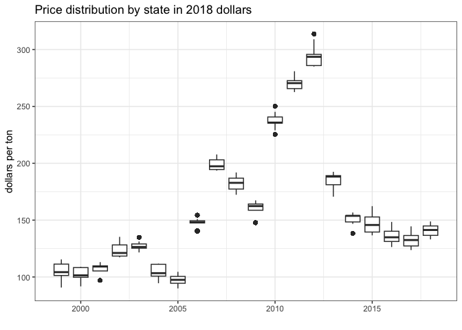
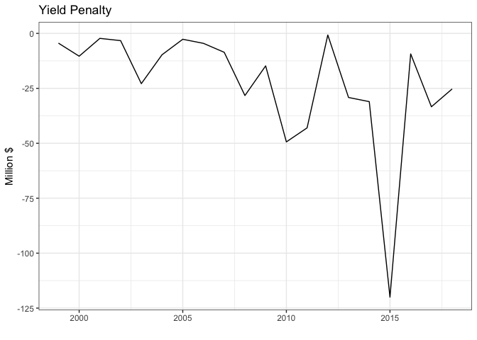
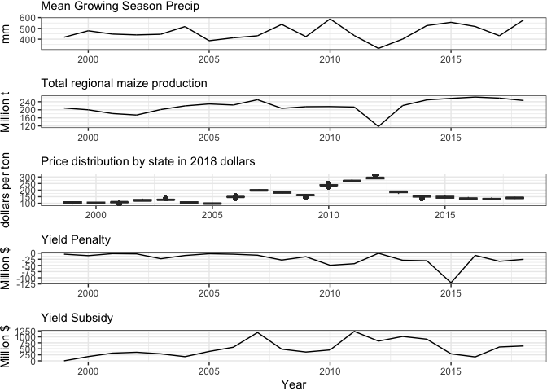

**Goal: estimate monetary value based on crop prices and benefit/penalty numbers**

This script makes supplementary figure S4


Note: price data
Price data was downloaded manually from the NASS quickstats tool (https://quickstats.nass.usda.gov/) for the following query: SURVEY - CROPS - FIELD CROPS - CORN - PRICE RECEIVED - 

* CORN, GRAIN - PRICE RECEIVED, MEASURED IN $ / BU

- TOTAL - STATE - ANNUAL 


**R Packages Needed**


```r
library(dplyr)
```

```
## Warning: package 'dplyr' was built under R version 4.2.3
```

```r
library(readr)
library(tidyr)
library(ggplot2)
library(patchwork)
```

```
## Warning: package 'patchwork' was built under R version 4.2.3
```

```r
library(tidycensus)
library(here)


sessionInfo()
```

```
## R version 4.2.1 (2022-06-23)
## Platform: aarch64-apple-darwin20 (64-bit)
## Running under: macOS 14.5
## 
## Matrix products: default
## BLAS:   /Library/Frameworks/R.framework/Versions/4.2-arm64/Resources/lib/libRblas.0.dylib
## LAPACK: /Library/Frameworks/R.framework/Versions/4.2-arm64/Resources/lib/libRlapack.dylib
## 
## locale:
## [1] en_US.UTF-8/en_US.UTF-8/en_US.UTF-8/C/en_US.UTF-8/en_US.UTF-8
## 
## attached base packages:
## [1] stats     graphics  grDevices utils     datasets  methods   base     
## 
## other attached packages:
## [1] here_1.0.1       tidycensus_1.2.3 patchwork_1.2.0  ggplot2_3.4.2   
## [5] tidyr_1.3.0      readr_2.1.2      dplyr_1.1.4      knitr_1.43      
## 
## loaded via a namespace (and not attached):
##  [1] tidyselect_1.2.1   xfun_0.39          bslib_0.5.0        purrr_1.0.1       
##  [5] sf_1.0-14          lattice_0.22-5     colorspace_2.1-0   vctrs_0.6.5       
##  [9] generics_0.1.3     htmltools_0.5.5    yaml_2.3.7         utf8_1.2.4        
## [13] rlang_1.1.3        e1071_1.7-11       jquerylib_0.1.4    pillar_1.9.0      
## [17] foreign_0.8-82     glue_1.7.0         withr_3.0.0        DBI_1.1.3         
## [21] rappdirs_0.3.3     sp_1.5-0           uuid_1.1-0         lifecycle_1.0.4   
## [25] stringr_1.5.0      munsell_0.5.0      gtable_0.3.3       rvest_1.0.2       
## [29] tigris_1.6.1       evaluate_0.21      tzdb_0.3.0         fastmap_1.1.1     
## [33] maptools_1.1-4     class_7.3-20       fansi_1.0.6        Rcpp_1.0.10       
## [37] KernSmooth_2.23-20 scales_1.2.1       classInt_0.4-7     cachem_1.0.8      
## [41] jsonlite_1.8.7     hms_1.1.1          digest_0.6.33      stringi_1.7.12    
## [45] rprojroot_2.0.3    grid_4.2.1         rgdal_1.5-32       cli_3.6.2         
## [49] tools_4.2.1        magrittr_2.0.3     sass_0.4.7         proxy_0.4-27      
## [53] tibble_3.2.1       crayon_1.5.1       pkgconfig_2.0.3    ellipsis_0.3.2    
## [57] xml2_1.3.3         rmarkdown_2.23     httr_1.4.3         rstudioapi_0.13   
## [61] R6_2.5.1           units_0.8-0        compiler_4.2.1
```

# Directories

To run "analysis" scripts, please download the zipped data folder at [https://zenodo.org/doi/10.5281/zenodo.13274562](https://zenodo.org/doi/10.5281/zenodo.13274562) and save to your local computer. Use the filepath to "RepoData" for the `masterDataDir` variable at the top of each analysis script in the "Directories" code chunk.


```r
projDir <- here::here()

# nass info
miscDir <- paste0(projDir,'/data/misc')
price_fn <- 'NASS_cornPriceRecieved_byState_annual_1999-2023.csv'

# cpi adjustment file in nass dir
cpiFile <- 'cpi_priceAdjustments.csv'

# crop area data based on SCYM (so CDL and Wang et al)
scymCoverageBase <- 'yieldCoverage_scym9_polygrid.csv'


# for master data file (yields)
masterDataDir <- '/Users/Documents/projects/2022_compass_GLM/paper_gw_subsidy/data/RepoData'
psimFilename <- 'masterData_apsimGrid.rds'


# output folder: clean df for figures
repoDataDir <- paste0(here::here(),'/data/analysisOutput_forFigs')
```


# Load PSIM and assign conditions


```r
# subsidy bounds from ale plot scym (3.03, 6.30)
zoneMin <- 1.05
zoneMax <- 2.5

# load and process psim
psim0 <- readRDS(paste0(masterDataDir,'/',psimFilename)) %>% 
  filter(year < 2019 & scym2020_10prct == 1)

# assign status-es to each psim grid-year
psim <- psim0 %>%
  mutate(gwPenalty = case_when(WT_Jul_m < zoneMin ~ 1),  # penaltly flag
         # check weather conditions for subsidy
         weather2_dry = case_when(spei_ju1 <= -50 ~ 1),
         weather3_xDry = case_when(spei_ju1 <= -150 ~ 1), 
         # flag for subsidy conditions
         gwSubsidy0 = case_when(WT_Jul_m >= zoneMin & WT_Jul_m <= zoneMax ~ 1),
         gwSubsidy_dry = case_when(weather2_dry == 1 & gwSubsidy0 == 1 ~ 1),
         gwSubsidy_xDry = case_when(weather3_xDry == 1 & gwSubsidy0 ==1 ~1))
```


# load crop area and process
maize area by grid

in this file, the "yield_tha" variables is the # of 30m pixels within the 7.5 km psim grid cell that have valid yield values (aka crop presence
)

```r
## coverage - load annual files into 1 df
filesCover <- list.files(miscDir, pattern = scymCoverageBase, full.names = TRUE)
coverage <- purrr::map_df(filesCover, function(x){
  df <- read_csv(x) %>%
    mutate(scym2020_perc = (yield_tha/cellCount*100)) %>%
    dplyr::select(psim_id, year, cellCount, yield_tha,scym2020_perc)
  })
```

```
## Rows: 25043 Columns: 9
## ── Column specification ────────────────────────────────────────────────────────
## Delimiter: ","
## chr (3): system:index, state, .geo
## dbl (6): cellCount, psim_id, scym9, year, yield_tha, yield_tha_noW
## 
## ℹ Use `spec()` to retrieve the full column specification for this data.
## ℹ Specify the column types or set `show_col_types = FALSE` to quiet this message.
## Rows: 25043 Columns: 9
## ── Column specification ────────────────────────────────────────────────────────
## Delimiter: ","
## chr (3): system:index, state, .geo
## dbl (6): cellCount, psim_id, scym9, year, yield_tha, yield_tha_noW
## 
## ℹ Use `spec()` to retrieve the full column specification for this data.
## ℹ Specify the column types or set `show_col_types = FALSE` to quiet this message.
## Rows: 25043 Columns: 9
## ── Column specification ────────────────────────────────────────────────────────
## Delimiter: ","
## chr (3): system:index, state, .geo
## dbl (6): cellCount, psim_id, scym9, year, yield_tha, yield_tha_noW
## 
## ℹ Use `spec()` to retrieve the full column specification for this data.
## ℹ Specify the column types or set `show_col_types = FALSE` to quiet this message.
## Rows: 25043 Columns: 9
## ── Column specification ────────────────────────────────────────────────────────
## Delimiter: ","
## chr (3): system:index, state, .geo
## dbl (6): cellCount, psim_id, scym9, year, yield_tha, yield_tha_noW
## 
## ℹ Use `spec()` to retrieve the full column specification for this data.
## ℹ Specify the column types or set `show_col_types = FALSE` to quiet this message.
## Rows: 25043 Columns: 9
## ── Column specification ────────────────────────────────────────────────────────
## Delimiter: ","
## chr (3): system:index, state, .geo
## dbl (6): cellCount, psim_id, scym9, year, yield_tha, yield_tha_noW
## 
## ℹ Use `spec()` to retrieve the full column specification for this data.
## ℹ Specify the column types or set `show_col_types = FALSE` to quiet this message.
## Rows: 25043 Columns: 9
## ── Column specification ────────────────────────────────────────────────────────
## Delimiter: ","
## chr (3): system:index, state, .geo
## dbl (6): cellCount, psim_id, scym9, year, yield_tha, yield_tha_noW
## 
## ℹ Use `spec()` to retrieve the full column specification for this data.
## ℹ Specify the column types or set `show_col_types = FALSE` to quiet this message.
## Rows: 25043 Columns: 9
## ── Column specification ────────────────────────────────────────────────────────
## Delimiter: ","
## chr (3): system:index, state, .geo
## dbl (6): cellCount, psim_id, scym9, year, yield_tha, yield_tha_noW
## 
## ℹ Use `spec()` to retrieve the full column specification for this data.
## ℹ Specify the column types or set `show_col_types = FALSE` to quiet this message.
## Rows: 25043 Columns: 9
## ── Column specification ────────────────────────────────────────────────────────
## Delimiter: ","
## chr (3): system:index, state, .geo
## dbl (6): cellCount, psim_id, scym9, year, yield_tha, yield_tha_noW
## 
## ℹ Use `spec()` to retrieve the full column specification for this data.
## ℹ Specify the column types or set `show_col_types = FALSE` to quiet this message.
## Rows: 25043 Columns: 9
## ── Column specification ────────────────────────────────────────────────────────
## Delimiter: ","
## chr (3): system:index, state, .geo
## dbl (6): cellCount, psim_id, scym9, year, yield_tha, yield_tha_noW
## 
## ℹ Use `spec()` to retrieve the full column specification for this data.
## ℹ Specify the column types or set `show_col_types = FALSE` to quiet this message.
## Rows: 25043 Columns: 9
## ── Column specification ────────────────────────────────────────────────────────
## Delimiter: ","
## chr (3): system:index, state, .geo
## dbl (6): cellCount, psim_id, scym9, year, yield_tha, yield_tha_noW
## 
## ℹ Use `spec()` to retrieve the full column specification for this data.
## ℹ Specify the column types or set `show_col_types = FALSE` to quiet this message.
## Rows: 25043 Columns: 9
## ── Column specification ────────────────────────────────────────────────────────
## Delimiter: ","
## chr (3): system:index, state, .geo
## dbl (6): cellCount, psim_id, scym9, year, yield_tha, yield_tha_noW
## 
## ℹ Use `spec()` to retrieve the full column specification for this data.
## ℹ Specify the column types or set `show_col_types = FALSE` to quiet this message.
## Rows: 25043 Columns: 9
## ── Column specification ────────────────────────────────────────────────────────
## Delimiter: ","
## chr (3): system:index, state, .geo
## dbl (6): cellCount, psim_id, scym9, year, yield_tha, yield_tha_noW
## 
## ℹ Use `spec()` to retrieve the full column specification for this data.
## ℹ Specify the column types or set `show_col_types = FALSE` to quiet this message.
## Rows: 25043 Columns: 9
## ── Column specification ────────────────────────────────────────────────────────
## Delimiter: ","
## chr (3): system:index, state, .geo
## dbl (6): cellCount, psim_id, scym9, year, yield_tha, yield_tha_noW
## 
## ℹ Use `spec()` to retrieve the full column specification for this data.
## ℹ Specify the column types or set `show_col_types = FALSE` to quiet this message.
## Rows: 25043 Columns: 9
## ── Column specification ────────────────────────────────────────────────────────
## Delimiter: ","
## chr (3): system:index, state, .geo
## dbl (6): cellCount, psim_id, scym9, year, yield_tha, yield_tha_noW
## 
## ℹ Use `spec()` to retrieve the full column specification for this data.
## ℹ Specify the column types or set `show_col_types = FALSE` to quiet this message.
## Rows: 25043 Columns: 9
## ── Column specification ────────────────────────────────────────────────────────
## Delimiter: ","
## chr (3): system:index, state, .geo
## dbl (6): cellCount, psim_id, scym9, year, yield_tha, yield_tha_noW
## 
## ℹ Use `spec()` to retrieve the full column specification for this data.
## ℹ Specify the column types or set `show_col_types = FALSE` to quiet this message.
## Rows: 25043 Columns: 9
## ── Column specification ────────────────────────────────────────────────────────
## Delimiter: ","
## chr (3): system:index, state, .geo
## dbl (6): cellCount, psim_id, scym9, year, yield_tha, yield_tha_noW
## 
## ℹ Use `spec()` to retrieve the full column specification for this data.
## ℹ Specify the column types or set `show_col_types = FALSE` to quiet this message.
## Rows: 25043 Columns: 9
## ── Column specification ────────────────────────────────────────────────────────
## Delimiter: ","
## chr (3): system:index, state, .geo
## dbl (6): cellCount, psim_id, scym9, year, yield_tha, yield_tha_noW
## 
## ℹ Use `spec()` to retrieve the full column specification for this data.
## ℹ Specify the column types or set `show_col_types = FALSE` to quiet this message.
## Rows: 25043 Columns: 9
## ── Column specification ────────────────────────────────────────────────────────
## Delimiter: ","
## chr (3): system:index, state, .geo
## dbl (6): cellCount, psim_id, scym9, year, yield_tha, yield_tha_noW
## 
## ℹ Use `spec()` to retrieve the full column specification for this data.
## ℹ Specify the column types or set `show_col_types = FALSE` to quiet this message.
## Rows: 25043 Columns: 9
## ── Column specification ────────────────────────────────────────────────────────
## Delimiter: ","
## chr (3): system:index, state, .geo
## dbl (6): cellCount, psim_id, scym9, year, yield_tha, yield_tha_noW
## 
## ℹ Use `spec()` to retrieve the full column specification for this data.
## ℹ Specify the column types or set `show_col_types = FALSE` to quiet this message.
## Rows: 25043 Columns: 9
## ── Column specification ────────────────────────────────────────────────────────
## Delimiter: ","
## chr (3): system:index, state, .geo
## dbl (6): cellCount, psim_id, scym9, year, yield_tha, yield_tha_noW
## 
## ℹ Use `spec()` to retrieve the full column specification for this data.
## ℹ Specify the column types or set `show_col_types = FALSE` to quiet this message.
## Rows: 25043 Columns: 9
## ── Column specification ────────────────────────────────────────────────────────
## Delimiter: ","
## chr (3): system:index, state, .geo
## dbl (6): cellCount, psim_id, scym9, year, yield_tha, yield_tha_noW
## 
## ℹ Use `spec()` to retrieve the full column specification for this data.
## ℹ Specify the column types or set `show_col_types = FALSE` to quiet this message.
## Rows: 25043 Columns: 9
## ── Column specification ────────────────────────────────────────────────────────
## Delimiter: ","
## chr (3): system:index, state, .geo
## dbl (6): cellCount, psim_id, scym9, year, yield_tha, yield_tha_noW
## 
## ℹ Use `spec()` to retrieve the full column specification for this data.
## ℹ Specify the column types or set `show_col_types = FALSE` to quiet this message.
```

```r
# coverage ranges - percent of psim grid cell
summary(coverage$scym2020_perc)
```

```
##    Min. 1st Qu.  Median    Mean 3rd Qu.    Max. 
##   0.000   0.000   5.764  13.943  25.094  84.098
```

```r
# and calculate total ha of maize scym 2020
maize_ha <- coverage %>%
  mutate(cell_m2 = yield_tha * (30*30), # count of active cells x cell area
         cell_ha = cell_m2 / 10000) 
```

# load price and merge


```r
# price data for maize
price00 <- read_csv(paste0(miscDir,'/',price_fn))
```

```
## Rows: 216 Columns: 21
## ── Column specification ────────────────────────────────────────────────────────
## Delimiter: ","
## chr (9): Program, Period, Geo Level, State, watershed_code, Commodity, Data ...
## dbl (3): Year, State ANSI, Value
## lgl (9): Week Ending, Ag District, Ag District Code, County, County ANSI, Zi...
## 
## ℹ Use `spec()` to retrieve the full column specification for this data.
## ℹ Specify the column types or set `show_col_types = FALSE` to quiet this message.
```

```r
price0 <- price00 %>%
  dplyr::select(c(State, Year, Value)) %>%
  filter(Year >= 1999 & Year <= 2018) %>%
  rename(Price_dpbu = Value)

# adjust prices
# load consumer price index adjustments
cpi <- read_csv(paste0(miscDir, '/',cpiFile)) %>%
  dplyr::select(cpi_year, adj_factor_2018) %>%
  rename(year = cpi_year)
```

```
## Rows: 72 Columns: 6
## ── Column specification ────────────────────────────────────────────────────────
## Delimiter: ","
## dbl (6): cpi_year, cpi, adj_factor_2015, adj_factor_2016, adj_factor_2017, a...
## 
## ℹ Use `spec()` to retrieve the full column specification for this data.
## ℹ Specify the column types or set `show_col_types = FALSE` to quiet this message.
```

```r
# add state code as "state"
data("fips_codes") # from tidycensus
fips_states <- fips_codes %>%
  dplyr::select(c(state, state_name)) %>%
  group_by(state) %>%
  slice(1) %>%
  mutate(State = toupper(state_name)) 

price <- price0 %>%
  left_join(fips_states) %>%
  dplyr::select(state,Year, Price_dpbu)
```

```
## Joining with `by = join_by(State)`
```

```r
# make master subsidy/penalty, yield, and price data
combo <- psim %>%
  dplyr::select(c(psim_id,state, year,yield_tha, pr_grow,
                  gwPenalty, gwSubsidy_dry, gwSubsidy_xDry, WT_Jul_m)) %>%
  left_join(price %>% rename(year = Year)) %>%
  mutate(Price_dpt = Price_dpbu * 39.3683) %>%
  left_join(maize_ha %>% dplyr::select(psim_id, year, cell_ha)) %>%
  # add adjusted price
  left_join(cpi) %>%
  mutate(Price_dpt_adj = Price_dpt / adj_factor_2018)
```

```
## Joining with `by = join_by(state, year)`
## Joining with `by = join_by(psim_id, year)`
## Joining with `by = join_by(year)`
```

```r
combo %>% select(contains('Price'))
```

```
## # A tibble: 205,443 × 3
##    Price_dpbu Price_dpt Price_dpt_adj
##         <dbl>     <dbl>         <dbl>
##  1       1.72      67.7         101. 
##  2       1.75      68.9          99.7
##  3       1.9       74.8         105. 
##  4       2.22      87.4         121. 
##  5       2.37      93.3         126. 
##  6       1.99      78.3         103. 
##  7       1.94      76.4          97.5
##  8       3.03     119.          148. 
##  9       4.29     169.          203. 
## 10       4.1      161.          187. 
## # ℹ 205,433 more rows
```

```r
plot_price <- ggplot(combo,
       aes(x = year, y = Price_dpt_adj, group = year)) +
  geom_boxplot() + ylab('dollars per ton') +
  theme_bw() + xlab('') + ggtitle('Price distribution by state in 2018 dollars')

plot_price
```

<!-- -->


# calculations

## gw penalty


```r
combo %>%
  filter(gwPenalty == 1) %>%
  summarize(meanDepth = mean(WT_Jul_m, na.rm = T))
```

```
## # A tibble: 1 × 1
##   meanDepth
##       <dbl>
## 1     0.853
```

```r
avgPenalty <- -0.01 # -1% is the change at .85

penalty <- combo %>%
  filter(gwPenalty == 1) %>%
  mutate(penalty = yield_tha * avgPenalty * cell_ha * Price_dpt_adj ,
          totalYield = yield_tha * cell_ha)

penaltyByYear <- penalty %>%
  group_by(year) %>%
  summarize(penalty = sum(penalty, na.rm = T),
            yieldTotal = sum(totalYield,na.rm = T)) %>%
  ungroup()

plot_penalty <- ggplot(penaltyByYear,
       aes(x = year, y = penalty/1000000)) +
  geom_line() +
  ylab('Million $') + xlab('') +
  theme_bw() + ggtitle('Yield Penalty')
plot_penalty
```

<!-- -->


## gw subsidy
apply the high rate in cells that meet xDry conditions before applying the typical rate for other cells


```r
# set subsidies
maxYieldBoost_dry <- .034 # ~3.4 percent boost
maxYieldBoost_xDry <- maxYieldBoost_dry * 2


# psims based subsidy
subsidyXdry_max <- combo %>%
  filter(gwSubsidy_xDry == 1) %>%
  mutate(subsidy_max = yield_tha * maxYieldBoost_xDry * cell_ha * Price_dpt_adj ,
          totalYield = yield_tha * cell_ha)

subsidy_dry_max <- combo %>%
  filter(is.na(gwSubsidy_xDry) & gwSubsidy_dry == 1) %>%
  mutate(subsidy_max = yield_tha * maxYieldBoost_dry * cell_ha * Price_dpt_adj,
          totalYield = yield_tha * cell_ha)


# combine and aggregate
totalSubsidy <- subsidyXdry_max %>% bind_rows(subsidy_dry_max) 

subsidyByYear <- totalSubsidy %>%
  group_by(year) %>%
  summarize(subSidyTotal = sum(subsidy_max, na.rm = T),
            yieldTotal = sum(totalYield,na.rm = T)) %>%
  ungroup() %>%
  bind_rows(data.frame(year = 1999,
                       subSidyTotal = 0))

plot_subsidy <- ggplot(subsidyByYear,
       aes(x = year, y = subSidyTotal/1000000)) +
  geom_line() +
  ylab('Million $') + xlab('Year') +
  theme_bw() + ggtitle('Yield Subsidy')

# other things
totalProduction <- combo %>%
  mutate(production = yield_tha * cell_ha) %>%
  group_by(year) %>%
  mutate(totalProduction = sum(production, na.rm = TRUE))

plot_yield <- ggplot(totalProduction,
       aes(x = year, y = totalProduction/1000000)) +
  geom_line() +
  ylab('Million t') + xlab('') +
  theme_bw() + ggtitle('Total regional maize production')

# other things2
precip <- combo %>%
  group_by(year) %>%
  mutate(ppt = mean(pr_grow, na.rm = TRUE))

plot_precip <- ggplot(precip,
       aes(x = year, y = ppt)) +
  geom_line() +
  ylab('mm') + xlab('') +
  theme_bw() + ggtitle('Mean Growing Season Precip')

plot_summary <- plot_precip / plot_yield / plot_price / plot_penalty / plot_subsidy &
  theme(plot.title = element_text(size = 11),
        plot.margin = margin(.2,.2,.2,.2,'pt'))
plot_summary
```

<!-- -->

```r
# ggsave(filename = paste0(figDir,'/FigS4_money_5panel_timeseries.png'),
#        plot = plot_summary,
#        width = 6.5, height = 7, dpi = 300, units = 'in')
# 
# ggsave(filename = paste0(figDir,'/FigS4_money_5panel_timeseries.pdf'),
#        plot = plot_summary,
#        width = 6.5, height = 7, dpi = 300, units = 'in')
```


get total numbers for study period


```r
# annual range
subsidyByYear %>%  
  filter(year != 1999) %>%
  slice_min(subSidyTotal)
```

```
## # A tibble: 1 × 3
##    year subSidyTotal yieldTotal
##   <dbl>        <dbl>      <dbl>
## 1  2016   163927807.  34404702.
```

```r
subsidyByYear %>%  slice_max(subSidyTotal)
```

```
## # A tibble: 1 × 3
##    year subSidyTotal yieldTotal
##   <dbl>        <dbl>      <dbl>
## 1  2011  1228834386. 118315885.
```

```r
# total for study period
subsidyByYear %>% 
  summarize(subSidyTotal = sum(subSidyTotal, na.rm = T))
```

```
## # A tibble: 1 × 1
##   subSidyTotal
##          <dbl>
## 1 10401691355.
```

```r
# total penalties
penaltyByYear
```

```
## # A tibble: 20 × 3
##     year     penalty yieldTotal
##    <dbl>       <dbl>      <dbl>
##  1  1999   -4430143.   4081227.
##  2  2000  -10371065.   9806242.
##  3  2001   -2263031.   2065383.
##  4  2002   -3286911.   2572105.
##  5  2003  -22863360.  17220131.
##  6  2004   -9714836.   9208097.
##  7  2005   -2666851.   2674254.
##  8  2006   -4532417.   2982077.
##  9  2007   -8595399.   4213073.
## 10  2008  -28274136.  15268898.
## 11  2009  -14778223.   9058385.
## 12  2010  -49369635.  20893057.
## 13  2011  -42987817.  15961859.
## 14  2012    -730264.    241629.
## 15  2013  -29153555.  15541008.
## 16  2014  -31047972.  20240103.
## 17  2015 -120014708.  77195809.
## 18  2016   -9331795.   6604691.
## 19  2017  -33385559.  23599507.
## 20  2018  -25271928.  18204559.
```

```r
penaltyByYear %>% 
  summarize(penaltyTotal = sum(penalty, na.rm = T))
```

```
## # A tibble: 1 × 1
##   penaltyTotal
##          <dbl>
## 1  -453069605.
```

