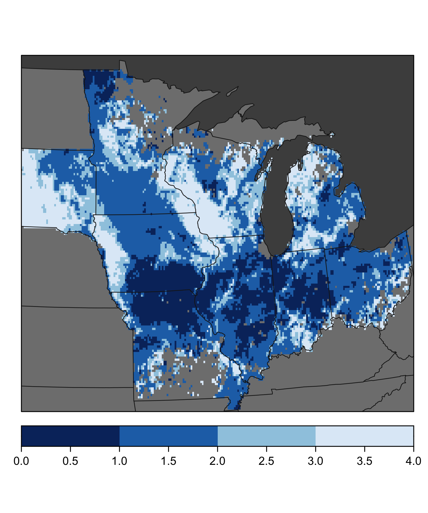
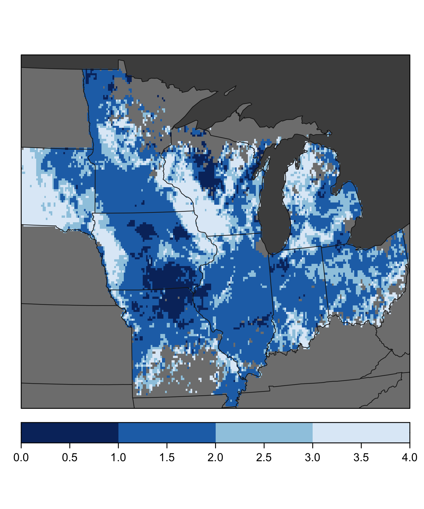
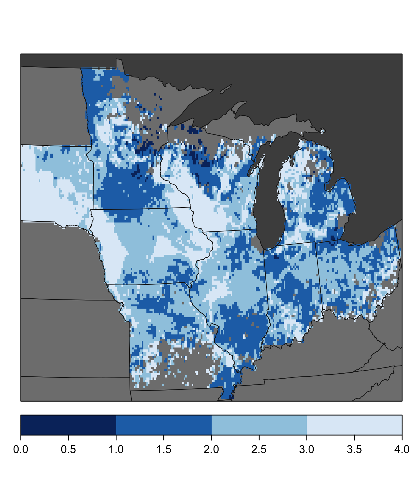
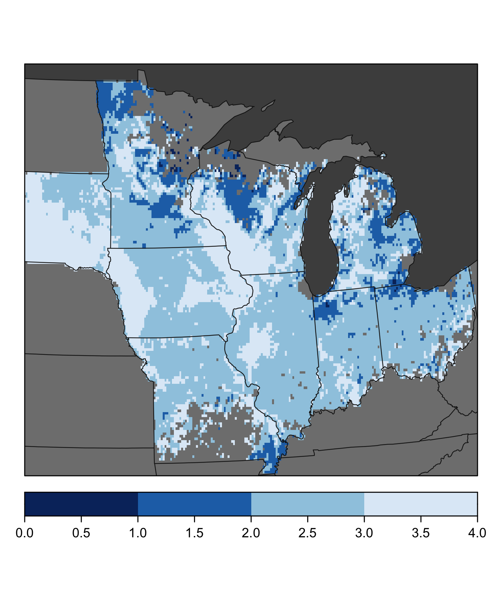
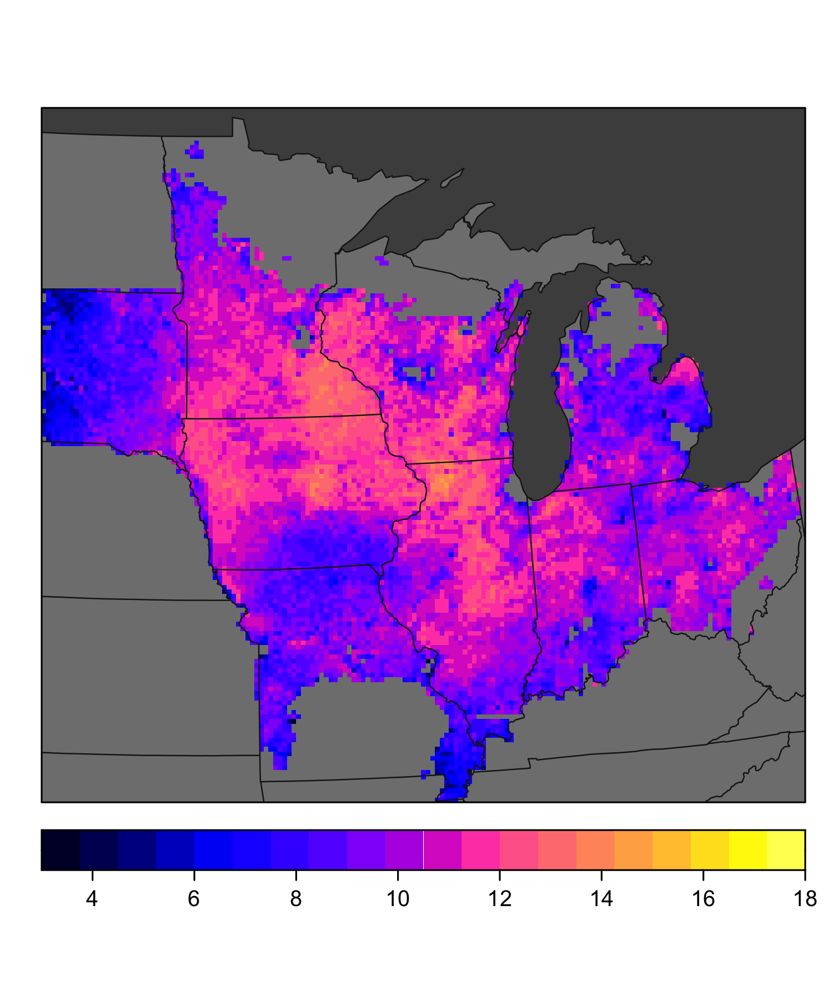
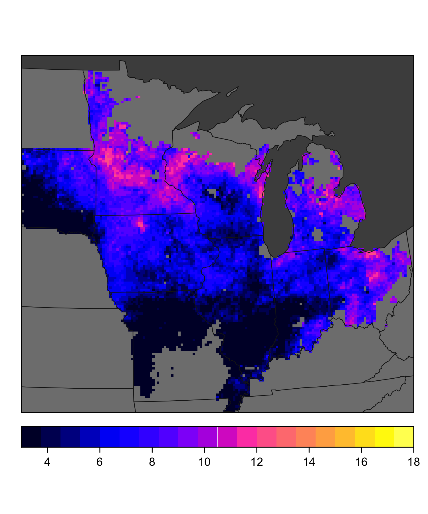

**Goal: study area fig with water table / psim info**


**R Packages Needed**


```r
library(readr)
library(dplyr)
```

```
## Warning: package 'dplyr' was built under R version 4.2.3
```

```r
library(ggplot2)
library(sf)
library(rgdal)
library(raster)
library(stars)
library(latticeExtra)
library(RColorBrewer)

library(here)

sessionInfo()
```

```
## R version 4.2.1 (2022-06-23)
## Platform: aarch64-apple-darwin20 (64-bit)
## Running under: macOS 14.5
## 
## Matrix products: default
## BLAS:   /Library/Frameworks/R.framework/Versions/4.2-arm64/Resources/lib/libRblas.0.dylib
## LAPACK: /Library/Frameworks/R.framework/Versions/4.2-arm64/Resources/lib/libRlapack.dylib
## 
## locale:
## [1] en_US.UTF-8/en_US.UTF-8/en_US.UTF-8/C/en_US.UTF-8/en_US.UTF-8
## 
## attached base packages:
## [1] stats     graphics  grDevices utils     datasets  methods   base     
## 
## other attached packages:
##  [1] here_1.0.1          RColorBrewer_1.1-3  latticeExtra_0.6-30
##  [4] lattice_0.22-5      stars_0.5-6         abind_1.4-5        
##  [7] raster_3.6-20       rgdal_1.5-32        sp_1.5-0           
## [10] sf_1.0-14           ggplot2_3.4.2       dplyr_1.1.4        
## [13] readr_2.1.2         knitr_1.43         
## 
## loaded via a namespace (and not attached):
##  [1] tidyselect_1.2.1   terra_1.7-29       xfun_0.39          bslib_0.5.0       
##  [5] colorspace_2.1-0   vctrs_0.6.5        generics_0.1.3     htmltools_0.5.5   
##  [9] yaml_2.3.7         utf8_1.2.4         rlang_1.1.3        e1071_1.7-11      
## [13] jquerylib_0.1.4    pillar_1.9.0       glue_1.7.0         withr_3.0.0       
## [17] DBI_1.1.3          jpeg_0.1-10        lifecycle_1.0.4    munsell_0.5.0     
## [21] gtable_0.3.3       codetools_0.2-18   evaluate_0.21      tzdb_0.3.0        
## [25] fastmap_1.1.1      parallel_4.2.1     class_7.3-20       fansi_1.0.6       
## [29] Rcpp_1.0.10        KernSmooth_2.23-20 scales_1.2.1       classInt_0.4-7    
## [33] cachem_1.0.8       lwgeom_0.2-13      jsonlite_1.8.7     deldir_1.0-6      
## [37] interp_1.1-3       png_0.1-7          hms_1.1.1          digest_0.6.33     
## [41] rprojroot_2.0.3    grid_4.2.1         cli_3.6.2          tools_4.2.1       
## [45] magrittr_2.0.3     sass_0.4.7         proxy_0.4-27       tibble_3.2.1      
## [49] pkgconfig_2.0.3    ellipsis_0.3.2     rmarkdown_2.23     rstudioapi_0.13   
## [53] R6_2.5.1           units_0.8-0        compiler_4.2.1
```

# Directories


```r
# repo gis data folder
gisDir <- paste0(here::here(),'/data/gis')
rasterDir <- paste0(gisDir,'/rasters_fig1')


# geo vis - state boundaries
boundDir <- paste0(gisDir,'/boundaries')
```

# plot specs

```r
## half of s dakota
mapXLim <- c(-350000,1300000)
mapYLim <- c(1450000,2950000)

panelBackground <- 'gray30'
stateLines <- 'gray10'
stateFill <- 'gray50'
pioneerOutline <- 'black'


pal <- rev(brewer.pal(n = 9, name = 'Blues')[c(2,4,7,9)])


# state outlines

states2 <- read_sf(paste0(boundDir,'/States_continental.shp')) %>%
  st_transform(5070)
states_sp <- as(states2, 'Spatial')
```


# Histogram: monthly water tables
from PSIMS run output

## load and get stats
gw distribution over growing season
2010 and 2012


```r
may2010 <- raster(paste0(rasterDir,'/WT_May_2010.tif'))
may2012 <- raster(paste0(rasterDir,'/WT_May_2012.tif'))


june2010 <- raster(paste0(rasterDir,'/WT_June_2010.tif'))
june2012 <- raster(paste0(rasterDir,'/WT_June_2012.tif'))


july2010 <- raster(paste0(rasterDir,'/WT_July_2010.tif'))
july2012 <- raster(paste0(rasterDir,'/WT_July_2012.tif'))


aug2010 <- raster(paste0(rasterDir,'/WT_Aug_2010.tif'))
aug2012 <- raster(paste0(rasterDir,'/WT_Aug_2012.tif'))


# 2010 summary
may10 <- as.data.frame(summary(may2010))
jun10 <- as.data.frame(summary(june2010))
jul10 <- as.data.frame(summary(july2010))
aug10 <- as.data.frame(summary(aug2010))
stats2010 <- cbind(rownames(may10),may10,jun10,jul10, aug10)
names(stats2010) <- c('summary','5-May','6-June','7-July','8-Aug')
rownames(stats2010) <- 1:6
stats2010$year <- 2010


may12 <- as.data.frame(summary(may2012))
jun12 <- as.data.frame(summary(june2012))
jul12 <- as.data.frame(summary(july2012))
aug12 <- as.data.frame(summary(aug2012))
stats2012 <- cbind(rownames(may12),may12,jun12,jul12, aug12)
names(stats2012) <- c('summary','5-May','6-June','7-July','8-Aug')
rownames(stats2012) <- 1:6
stats2012$year <- 2012

statsBoth <- stats2010 %>% bind_rows(stats2012)

statsLong <- statsBoth %>%
  filter(summary != "NA's") %>%
  tidyr::gather(., key = month, value = value, contains('-')) %>%
  tidyr::spread(., key = summary, value = value)
```

## histogram


```r
ggplot(statsLong,
       aes(x = month,  group = interaction(month,year),
           ymin = `Min.`, lower = `1st Qu.`, middle = Median, upper = `3rd Qu.`, ymax = `Max.`)) +
  facet_wrap(~year, nrow = 2) +
  ylim(4, 0) +
  geom_hline(yintercept = 0, linetype = 'dotted') +
  ylab('Depth to Water (m)') + xlab('Month') +
  geom_boxplot(stat = 'identity') +
  theme_bw() + theme(axis.text = element_text(size = 8),
                     axis.title = element_text(size = 9))
```

<!-- -->


# individual MONTHS - maps

## 2010


```r
june2010p <- projectRaster(june2010, crs = projection(states_sp))

spplot(june2010p, axes = TRUE, col.regions= pal,
       at=c(0,1,2,3,4),
       colorkey = list(space = 'bottom'),
       maxpixels = 1500000,
       xlim = mapXLim, ylim = mapYLim,
       par.settings = list(panel.background = list(col=panelBackground))) +
  latticeExtra::layer(sp.polygons(states_sp, lwd=.8, col=stateLines)) +
  latticeExtra::layer(sp.polygons(states_sp, lwd=.8, col=NA, fill = stateFill), under=T)
```

<!-- -->


```r
july2010p <- projectRaster(july2010, crs = projection(states_sp))

spplot(july2010p, axes = TRUE, col.regions= pal,
       at=c(0,1,2,3,4),
       colorkey = list(space = 'bottom'),
       maxpixels = 1500000,
       xlim = mapXLim, ylim = mapYLim,
       par.settings = list(panel.background = list(col=panelBackground))) +
  latticeExtra::layer(sp.polygons(states_sp, lwd=.8, col=stateLines)) +
  latticeExtra::layer(sp.polygons(states_sp, lwd=.8, col=NA, fill = stateFill), under=T)
```

<!-- -->

## 2012


```r
june2012p <- projectRaster(june2012, crs = projection(states_sp))

spplot(june2012p, axes = TRUE, col.regions= pal,
       at=c(0,1,2,3,4),
       colorkey = list(space = 'bottom'),
       maxpixels = 1500000,
        xlim = mapXLim, ylim = mapYLim,
       par.settings = list(panel.background = list(col=panelBackground))) +
  latticeExtra::layer(sp.polygons(states_sp, lwd=.8, col=stateLines)) +
  latticeExtra::layer(sp.polygons(states_sp, lwd=.8, col=NA, fill = stateFill), under=T)
```

<!-- -->


```r
july2012p <- projectRaster(july2012, crs = projection(states_sp))

spplot(july2012p, axes = TRUE, col.regions= pal,
       at=c(0,1,2,3,4),
       colorkey = list(space = 'bottom'),
       maxpixels = 1500000,
       xlim = mapXLim, ylim = mapYLim,
       par.settings = list(panel.background = list(col=panelBackground))) +
  latticeExtra::layer(sp.polygons(states_sp, lwd=.8, col=stateLines)) +
  latticeExtra::layer(sp.polygons(states_sp, lwd=.8, col=NA, fill = stateFill), under=T)
```

<!-- -->


## legend plot


```r
june2010p <- projectRaster(june2010, crs = projection(states_sp))

spplot(june2010p, axes = TRUE, col.regions= pal,
       at=c(0,1,2,3,4),
       colorkey = list(space = 'bottom'),
       maxpixels = 15000,
       xlim = mapXLim, ylim = mapYLim,
       par.settings = list(panel.background = list(col=panelBackground))) +
  latticeExtra::layer(sp.polygons(states_sp, lwd=.8, col=stateLines)) +
  latticeExtra::layer(sp.polygons(states_sp, lwd=.8, col=NA, fill = stateFill), under=T)
```

<!-- -->


# Yield Maps
for right size/map limits


```r
y2010 <- raster(paste0(rasterDir,'/2010_scym2020_20201107_10000m_NA.tif'))
y2010[y2010<0] <- NA

y2012 <- raster(paste0(rasterDir,'/2012_scym2020_20201107_10000m_NA.tif'))
y2012[y2012<0] <- NA
y2012[y2012<3] <- 3

cornMin <- 3
cornMax <- 18
colorbreaks = 20
```


```r
spplot(y2010, axes = TRUE,
       at=seq(cornMin, cornMax, (-cornMin + cornMax)/colorbreaks),
       colorkey = list(space = 'bottom'),
       maxpixels = 1500000,
       xlim = mapXLim, ylim = mapYLim,
       par.settings = list(panel.background = list(col=panelBackground))) +
  latticeExtra::layer(sp.polygons(states_sp, lwd=.8, col=stateLines)) +
  latticeExtra::layer(sp.polygons(states_sp, lwd=.8, col=NA, fill = stateFill), under=T)
```

<!-- -->


```r
spplot(y2012, axes = TRUE,
       at=seq(cornMin, cornMax, (-cornMin + cornMax)/colorbreaks),
       colorkey = list(space = 'bottom'),
       maxpixels = 1500000,
       xlim = mapXLim, ylim = mapYLim,
       par.settings = list(panel.background = list(col=panelBackground))) +
  latticeExtra::layer(sp.polygons(states_sp, lwd=.8, col=stateLines)) +
  latticeExtra::layer(sp.polygons(states_sp, lwd=.8, col=NA, fill = stateFill), under=T)
```

<!-- -->


```r
spplot(y2012, axes = TRUE,
       at=seq(cornMin, cornMax, (-cornMin + cornMax)/colorbreaks),
       colorkey = list(space = 'bottom'),
       maxpixels = 15000,
       xlim = mapXLim, ylim = mapYLim,
       par.settings = list(panel.background = list(col=panelBackground))) +
  latticeExtra::layer(sp.polygons(states_sp, lwd=.8, col=stateLines)) +
  latticeExtra::layer(sp.polygons(states_sp, lwd=.8, col=NA, fill = stateFill), under=T)
```

<!-- -->


