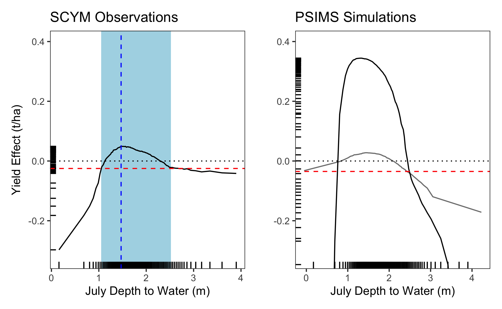
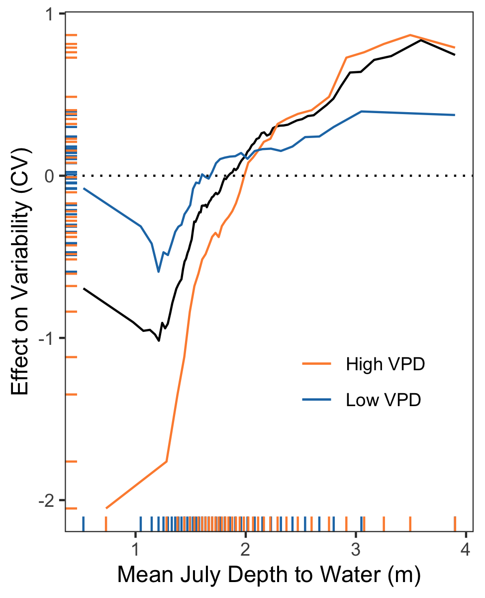
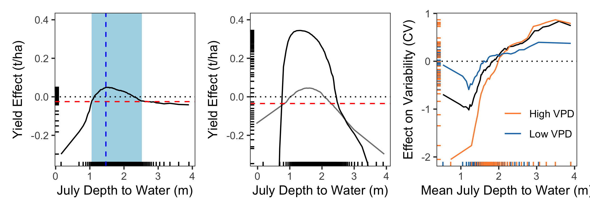
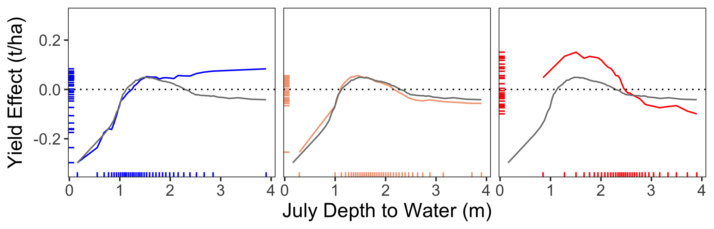

**Goal:  examine yield response to gw level**

Notes: 
* Cleaned datasets derived from:

  * yield response to gw levels: rf and ale plots run in 03.00
  * stability: analyses in 03.50


**R Packages Needed**


```r
library(dplyr)
```

```
## Warning: package 'dplyr' was built under R version 4.2.3
```

```r
library(readr)
library(ggplot2)
library(patchwork)
```

```
## Warning: package 'patchwork' was built under R version 4.2.3
```

```r
library(here)

sessionInfo()
```

```
## R version 4.2.1 (2022-06-23)
## Platform: aarch64-apple-darwin20 (64-bit)
## Running under: macOS 14.5
## 
## Matrix products: default
## BLAS:   /Library/Frameworks/R.framework/Versions/4.2-arm64/Resources/lib/libRblas.0.dylib
## LAPACK: /Library/Frameworks/R.framework/Versions/4.2-arm64/Resources/lib/libRlapack.dylib
## 
## locale:
## [1] en_US.UTF-8/en_US.UTF-8/en_US.UTF-8/C/en_US.UTF-8/en_US.UTF-8
## 
## attached base packages:
## [1] stats     graphics  grDevices utils     datasets  methods   base     
## 
## other attached packages:
## [1] here_1.0.1      patchwork_1.2.0 ggplot2_3.4.2   readr_2.1.2    
## [5] dplyr_1.1.4     knitr_1.43     
## 
## loaded via a namespace (and not attached):
##  [1] pillar_1.9.0     bslib_0.5.0      compiler_4.2.1   jquerylib_0.1.4 
##  [5] tools_4.2.1      digest_0.6.33    jsonlite_1.8.7   evaluate_0.21   
##  [9] lifecycle_1.0.4  tibble_3.2.1     gtable_0.3.3     pkgconfig_2.0.3 
## [13] rlang_1.1.3      cli_3.6.2        rstudioapi_0.13  yaml_2.3.7      
## [17] xfun_0.39        fastmap_1.1.1    withr_3.0.0      generics_0.1.3  
## [21] vctrs_0.6.5      sass_0.4.7       hms_1.1.1        rprojroot_2.0.3 
## [25] grid_4.2.1       tidyselect_1.2.1 glue_1.7.0       R6_2.5.1        
## [29] fansi_1.0.6      rmarkdown_2.23   tzdb_0.3.0       magrittr_2.0.3  
## [33] scales_1.2.1     htmltools_0.5.5  ellipsis_0.3.2   colorspace_2.1-0
## [37] utf8_1.2.4       munsell_0.5.0    cachem_1.0.8
```

# Directories and data files


```r
repoDataDir <- paste0(here::here(),'/data/analysisOutput_forFigs')

# plot data file names: scym and psim gw subsidy aleplots from 03.00
scymYield_df <- read_csv(paste0(repoDataDir,'/Fig3a_scym_yieldVsWT_aleplot_may2024_35kNoDupe_standardSoilM.csv'))
scymYield_df_enhanced <- read_csv(paste0(repoDataDir,'/Fig3a_scym_yieldVsWT_aleplot_may2024_35kNoDupe_EnhancedSoilM.csv'))


psimYield_df <- read_csv(paste0(repoDataDir,'/Fig3b_psim_yieldVsWT_aleplot_may2024_standardSoilM.csv'))
sa_master <- read_csv(paste0(repoDataDir,'/Fig3b_psims_SA_noDeep_may24_cor60.csv'))

scym_byPPET <- read_csv(paste0(repoDataDir,'/Fig3d_scym_yieldVsWT_byPPET_aleplot_oct23_35knoDupe.csv'))

# plot data files for stability analysis from 03.50
stability <- read_csv(paste0(repoDataDir,'/Fig3c_stabilityAnalysis_main_may24.csv'))
vpd <- read_csv(paste0(repoDataDir,'/Fig3c_stabilityAnalysis_vpd_may24.csv'))
```


# Plots

## SCYM 


```r
scym <- ggplot(scymYield_df,
       aes(x = psim7, y = YieldEffect)) +
   geom_rect(xmin = 1.05, xmax = 2.52, ymin = -Inf, ymax = Inf, fill = 'lightblue') +
  geom_line() +
  geom_rug() +
  coord_cartesian(ylim=c(-.325, 0.4)) +
  geom_hline(yintercept = 0, linetype = 'dotted') +
  geom_hline(yintercept = -.025, linetype = 'dashed', color = 'red') +
  geom_vline(xintercept = 1.47, linetype = 'dashed', color = 'blue') +
    xlab('July Depth to Water (m)') + ylab('Yield Effect (t/ha)') +
  theme_bw()+ theme(legend.position = 'none',
                      panel.grid.major.x = element_blank(),
                      panel.grid.major.y = element_blank(),
                     panel.grid.minor.y = element_blank(),
                      panel.grid.minor.x = element_blank()) +
  ggtitle('SCYM Observations')

scym
```

<!-- -->

```r
max(scymYield_df$YieldEffect)
```

```
## [1] 0.04910721
```

```r
scymYield_df %>%
  slice_max(YieldEffect)
```

```
## # A tibble: 1 × 2
##   psim7 YieldEffect
##   <dbl>       <dbl>
## 1  1.47      0.0491
```

```r
max(scymYield_df$YieldEffect) + 0.025
```

```
## [1] 0.07410721
```


for presentations: focused only on scym range


```r
scym_zoom <- ggplot(scymYield_df,
       aes(x = psim7, y = YieldEffect)) +
   geom_rect(xmin = 1.05, xmax = 2.52, ymin = -Inf, ymax = Inf, fill = 'lightblue') +
  geom_line() +
  geom_rug() +
  #coord_cartesian(ylim=c(-.325, 0.4)) +
  geom_hline(yintercept = 0, linetype = 'dotted') +
  geom_hline(yintercept = -.025, linetype = 'dashed', color = 'red') +
  geom_vline(xintercept = 1.47, linetype = 'dashed', color = 'blue') +
    xlab('July Depth to Water (m)') + ylab('Yield Effect (t/ha)') +
  theme_bw()+ theme(legend.position = 'none',
                      panel.grid.major.x = element_blank(),
                      panel.grid.major.y = element_blank(),
                     panel.grid.minor.y = element_blank(),
                      panel.grid.minor.x = element_blank())
scym_zoom
```

<!-- -->


## SCYM - enhanced model
accounts for capillary rise to soil moisture


```r
scym2 <- ggplot(scymYield_df_enhanced,
       aes(x = psim7, y = YieldEffect)) +
   geom_rect(xmin = 1.2, xmax = 2.48, ymin = -Inf, ymax = Inf, fill = 'lightblue') +
  geom_line() +
  geom_rug() +
  coord_cartesian(ylim=c(-.325, 0.4)) +
  geom_hline(yintercept = 0, linetype = 'dotted') +
  geom_hline(yintercept = -.005, linetype = 'dashed', color = 'red') +
  geom_vline(xintercept = 1.66, linetype = 'dashed', color = 'blue') +
    xlab('July Depth to Water (m)') + ylab('Yield Effect (t/ha)') +
  theme_bw()+ theme(legend.position = 'none',
                      panel.grid.major.x = element_blank(),
                      panel.grid.major.y = element_blank(),
                     panel.grid.minor.y = element_blank(),
                      panel.grid.minor.x = element_blank()) +
  ggtitle('SCYM Observations')

scym2
```

<!-- -->

```r
max(scymYield_df_enhanced$YieldEffect)
```

```
## [1] 0.03564984
```

```r
scymYield_df_enhanced %>%
  slice_max(YieldEffect)
```

```
## # A tibble: 1 × 2
##   psim7 YieldEffect
##   <dbl>       <dbl>
## 1  1.66      0.0356
```

```r
max(scymYield_df_enhanced$YieldEffect) + 0.005
```

```
## [1] 0.04064984
```


## PSIM


```r
noisy <- sa_master 

psim <- ggplot(psimYield_df,
       aes(x = psim7, y = YieldEffect)) +
  # geom_rect(xmin = .775, xmax = 2.48, ymin = -Inf, ymax = Inf, fill = 'lightblue') +
  geom_line(data = noisy, color = 'gray50') +
  geom_line() +
  
  geom_rug() +
  coord_cartesian(ylim=c(-.325, 0.4)) +
  geom_hline(yintercept = 0, linetype = 'dotted') +
  geom_hline(yintercept = -.035, linetype = 'dashed', color = 'red') +
  # geom_vline(xintercept = 1.23, linetype = 'dashed', color = 'blue') +
    xlab('July Depth to Water (m)') + ylab('Yield Effect (t/ha)') +
  theme_bw()+ theme(legend.position = 'none',
                      panel.grid.major.x = element_blank(),
                      panel.grid.major.y = element_blank(),
                     panel.grid.minor.y = element_blank(),
                      panel.grid.minor.x = element_blank()) +
  ggtitle('PSIMS Simulations')
psim
```

<!-- -->

```r
max(psimYield_df$YieldEffect)
```

```
## [1] 0.3443323
```

```r
psimYield_df %>%
  slice_max(YieldEffect)
```

```
## # A tibble: 1 × 2
##   psim7 YieldEffect
##   <dbl>       <dbl>
## 1  1.31       0.344
```

```r
max(psimYield_df$YieldEffect) + 0.025
```

```
## [1] 0.3693323
```

## combo: scym and psim


```r
psim2 <- psim +
  ylab('')
scym + psim2
```

<!-- -->

# Stability


```r
vpd_forPlot <- vpd %>% mutate(type = 'Mean July VPD',
                      vpd_tile = case_when(vpd_tile == 1 ~ 'Low VPD',
                                           vpd_tile == 2 ~ 'Moderate',
                                           vpd_tile == 3 ~ 'High VPD')) %>%
         filter(vpd_tile != 'Moderate')

stability2 <- stability %>% mutate(vpd_tile = 0, type = 'Combined')

stabilityPlot <- ggplot(stability2,
       aes(x = psim7, y = Effect)) +
  geom_line() +  
  #geom_rug() +
  geom_line(data =vpd_forPlot,
            aes(group = as.factor(vpd_tile), color =  as.factor(vpd_tile))) +
  geom_hline(yintercept = 0, linetype = 'dotted') +
    geom_rug(data =vpd_forPlot, aes(color = as.factor(vpd_tile))) +
  scale_color_manual(values = c('#fd8d3c', '#1f78b4'), name = 'Mean July VPD') +
  scale_linetype_manual(values=c( "twodash", "solid"))+
  ylab('Effect on Variability (CV)') + xlab('Mean July Depth to Water (m)') +
  theme_bw() + theme(legend.position = c(.73, .3),
                     panel.grid.minor = element_blank(),
                     panel.grid.major = element_blank(),
                     legend.background = element_blank(),
                     legend.title = element_blank())
stabilityPlot
```

<!-- -->

# trifecta


```r
scym2 <- scym +
  ggtitle(NULL) 

psim3 <- psim +
  ggtitle(NULL)

stabilityPlot2 <- stabilityPlot 

scym2 + psim3 + stabilityPlot2
```

<!-- -->

# Yield Effect by Water Deficit


```r
# combine with scym for all "baseline line" 
scymYield_df1 <- scymYield_df %>% mutate(speiJu_class = 1)
scymYield_df3 <- scymYield_df %>% mutate(speiJu_class = 3)
scymYield_df4 <- scymYield_df %>% mutate(speiJu_class = 4)
scymYield_addMe <- bind_rows(scymYield_df1,scymYield_df3,scymYield_df4) %>%
  mutate(type = 'all')

ppet_df <- scym_byPPET %>%
  rename(psim7 = psim_07_m)


ggplot(ppet_df %>% filter(speiJu_class != 2),
       aes(x = psim7, y = YieldEffect, group = as.factor(speiJu_class), 
           color =  as.factor(speiJu_class))) +
  geom_line() + 
  geom_rug() +
  geom_line(data = scymYield_addMe, col = 'gray50') +
  geom_hline(yintercept = 0, linetype = 'dotted') +
  scale_color_manual(values = c('blue','#f4a582','red'),
                     labels = c('wet','drier','very dry')) +
  facet_wrap(~speiJu_class, nrow = 1) + 
  coord_cartesian(ylim=c(-.325, 0.3)) +
  ylab('Yield Effect (t/ha)') + xlab('July Depth to Water (m)') +
  theme_bw() +  theme(legend.position = 'none',
                      panel.grid.major.x = element_blank(),
                      panel.grid.major.y = element_blank(),
                     panel.grid.minor.y = element_blank(),
                      panel.grid.minor.x = element_blank(),
                     text = element_text(size = 14),
                     strip.background = element_blank(),
                     strip.text.x = element_blank())  
```

<!-- -->

