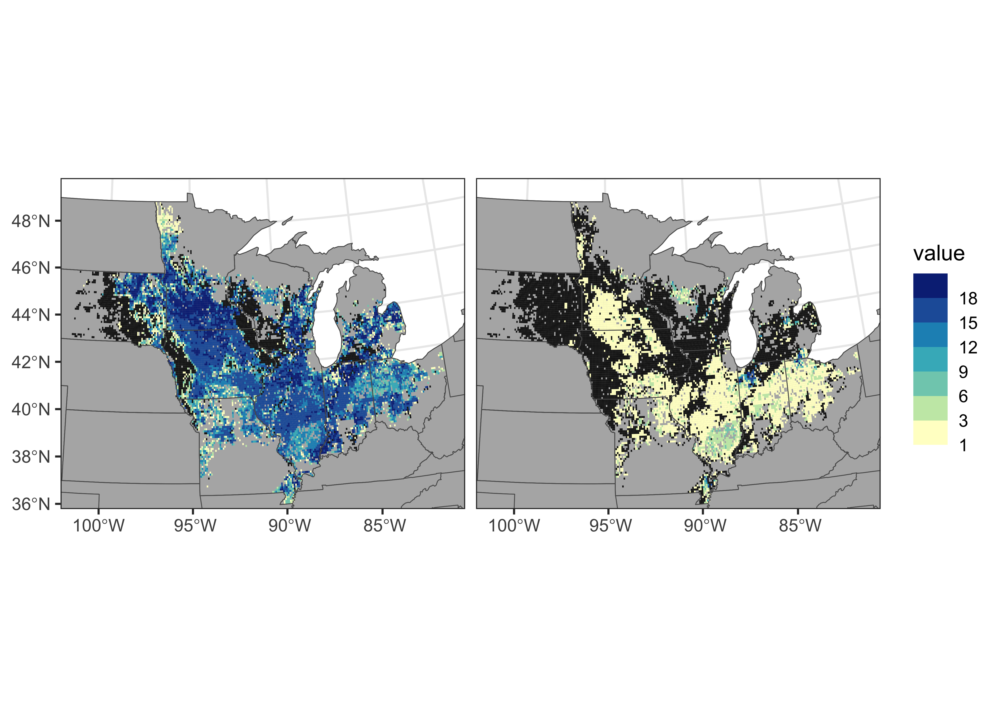
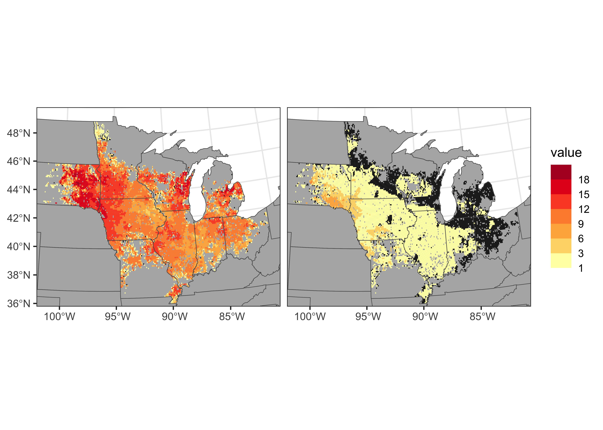
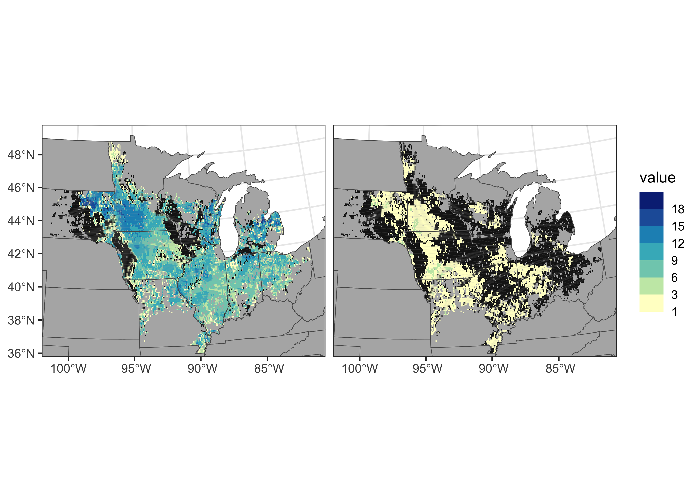
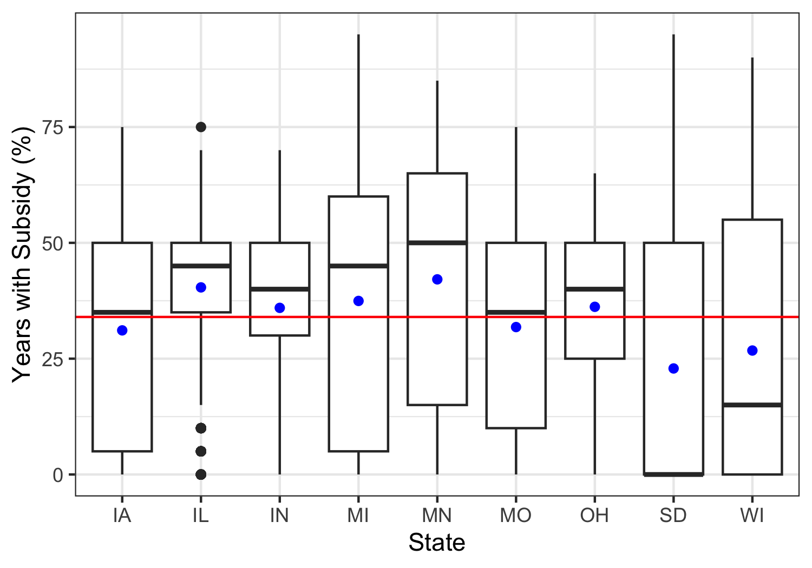

**Goal: Compose figure demonstrating subsidy/penalty prevalence**


**R Packages Needed**


```r
library(readr)
library(dplyr)
```

```
## Warning: package 'dplyr' was built under R version 4.2.3
```

```r
library(ggplot2)
library(sf)

library(here)

sessionInfo()
```

```
## R version 4.2.1 (2022-06-23)
## Platform: aarch64-apple-darwin20 (64-bit)
## Running under: macOS 14.5
## 
## Matrix products: default
## BLAS:   /Library/Frameworks/R.framework/Versions/4.2-arm64/Resources/lib/libRblas.0.dylib
## LAPACK: /Library/Frameworks/R.framework/Versions/4.2-arm64/Resources/lib/libRlapack.dylib
## 
## locale:
## [1] en_US.UTF-8/en_US.UTF-8/en_US.UTF-8/C/en_US.UTF-8/en_US.UTF-8
## 
## attached base packages:
## [1] stats     graphics  grDevices utils     datasets  methods   base     
## 
## other attached packages:
## [1] here_1.0.1    sf_1.0-14     ggplot2_3.4.2 dplyr_1.1.4   readr_2.1.2  
## [6] knitr_1.43   
## 
## loaded via a namespace (and not attached):
##  [1] Rcpp_1.0.10        pillar_1.9.0       bslib_0.5.0        compiler_4.2.1    
##  [5] jquerylib_0.1.4    class_7.3-20       tools_4.2.1        digest_0.6.33     
##  [9] jsonlite_1.8.7     evaluate_0.21      lifecycle_1.0.4    tibble_3.2.1      
## [13] gtable_0.3.3       pkgconfig_2.0.3    rlang_1.1.3        DBI_1.1.3         
## [17] cli_3.6.2          rstudioapi_0.13    yaml_2.3.7         xfun_0.39         
## [21] fastmap_1.1.1      e1071_1.7-11       withr_3.0.0        generics_0.1.3    
## [25] vctrs_0.6.5        sass_0.4.7         hms_1.1.1          rprojroot_2.0.3   
## [29] classInt_0.4-7     grid_4.2.1         tidyselect_1.2.1   glue_1.7.0        
## [33] R6_2.5.1           fansi_1.0.6        rmarkdown_2.23     tzdb_0.3.0        
## [37] magrittr_2.0.3     units_0.8-0        scales_1.2.1       ellipsis_0.3.2    
## [41] htmltools_0.5.5    colorspace_2.1-0   KernSmooth_2.23-20 utf8_1.2.4        
## [45] proxy_0.4-27       munsell_0.5.0      cachem_1.0.8
```

# Directories


```r
# data for psim grids to assign status (with July WT and water deficit)
repoDataDir <- paste0(here::here(),'/data/analysisOutput_forFigs')
psim0 <- read_csv(paste0(repoDataDir,'/Fig4_psimGridData.csv'))


# geo vis - spatial state boundaries and psim grid
gisDir <- paste0(here::here(),'/data/gis/boundaries')
statesAll <- read_sf(paste0(gisDir,'/States_continental.shp')) %>%
  st_transform(5070)
states <- statesAll  %>%
  dplyr::filter(STATE_ABBR %in% c('IN','IA','IL','OH','MI','WI','MN','SD','MO', 'ND','NE','KS', 'KY')) 

psimGrid <- read_sf(paste0(gisDir, '/psim_polygrid.shp')) %>%
  st_transform(5070)
```


# Load PSIM and assign conditions


```r
# subsidy bounds from ale plot scym (3.00, 6.30)
zoneMin <- 1.05
zoneMax <- 2.5

# assign status-es to each psim grid-year
psim <- psim0 %>%
  mutate(gwSubsidy = case_when(WT_Jul_m >= zoneMin & WT_Jul_m <= zoneMax ~ 1),
         gwPenalty = case_when(WT_Jul_m < zoneMin ~ 1),
         weather2_dry = case_when(spei_ju1 <= -50 ~ 1),
         weather3_xDry = case_when(spei_ju1 <= -150 ~ 1))
```

# gw occurance quantifier


```r
# how often do psim grid-years fall in penalty/subsidy zones?
sum(psim$gwPenalty == 1, na.rm = T) / nrow(psim) * 100   
```

```
## [1] 6.157912
```

```r
sum(psim$gwSubsidy == 1, na.rm = T) / nrow(psim) * 100 
```

```
## [1] 65.71799
```

```r
# count #years for each grid
gwFreq <- psim %>%
  group_by(psim_id, state) %>%
  summarize(a_subsidy = sum(gwSubsidy, na.rm = TRUE),
            penalty = sum(gwPenalty, na.rm = TRUE)) %>%
  ungroup()
```

```
## `summarise()` has grouped output by 'psim_id'. You can override using the
## `.groups` argument.
```

```r
# add counts to spatial grid
spatial_gwFreq <- psimGrid %>%
  left_join(gwFreq)
```

```
## Joining with `by = join_by(state, psim_id)`
```

```r
# long format amd prep for 0s to be NA
spatialSubLong_gw <- spatial_gwFreq %>%
  tidyr::gather(., key = type, value = value, a_subsidy:penalty) %>%
  filter(!is.na(value)) %>%                      # remove cells with no data
  mutate(value = case_when(value > 0 ~ value,    # make zero values na
                           value == 0 ~ NA))

# penalty and subsidy next to each other
ggplot(spatialSubLong_gw) +
  geom_sf(data = statesAll, fill = 'gray70')+ 
  geom_sf(aes(fill = value), color = NA, lwd = 0) +
  geom_sf(data = states, fill = NA)+ 
  coord_sf(xlim = c(-451032.2, 1292431), ylim = c(1502428, 2929298)) +
  facet_wrap(~type) +
  scale_fill_fermenter(n.breaks = 8, palette = 'YlGnBu', na.value = 'gray10',
                       direction = 1,
                       breaks = c(1,3,6,9,12,15,18)) +
    theme_bw() +  theme(strip.background = element_blank(),
                        strip.text.x = element_blank()) 
```

<!-- -->

# weather occurance quantifier


```r
# how often do psim grid-years fall in weather zones
sum(psim$weather2_dry == 1, na.rm = T) / nrow(psim)  * 100
```

```
## [1] 60.78766
```

```r
sum(psim$weather3_xDry == 1, na.rm = T) / nrow(psim)  * 100
```

```
## [1] 8.016335
```

```r
# count #years for each grid
weatherFreq = psim %>%
  group_by(psim_id, state) %>%
  summarize(weather2_dry = sum(weather2_dry, na.rm = TRUE),
            weather3_xDry = sum(weather3_xDry, na.rm = TRUE)) %>%
  ungroup()
```

```
## `summarise()` has grouped output by 'psim_id'. You can override using the
## `.groups` argument.
```

```r
# add counts to spatial grid
spatialSub_weather <- psimGrid %>%
  left_join(weatherFreq)
```

```
## Joining with `by = join_by(state, psim_id)`
```

```r
# long format
spatialSubLong_w <- spatialSub_weather %>%
  tidyr::gather(., key = type, value = value, weather2_dry:weather3_xDry) %>%
  filter(!is.na(value)) %>%                      # remove cells with no data
  mutate(value = case_when(value > 0 ~ value,    # make zero values na
                           value == 0 ~ NA))

ggplot(spatialSubLong_w ) +
  geom_sf(data = statesAll, fill = 'gray70')+ 
  geom_sf(aes(fill = value), color = NA, lwd = 0) +
  geom_sf(data = states, fill = NA)+ 
  coord_sf(xlim = c(-451032.2, 1292431), ylim = c(1502428, 2929298)) +
  facet_wrap(~type) +
  scale_fill_fermenter(n.breaks = 8, palette = 'YlOrRd', na.value = 'gray10',
                       direction = 1,
                       breaks = c(1,3,6,9,12,15,18)) +
    theme_bw() +  theme(strip.background = element_blank(),
                        strip.text.x = element_blank()) 
```

<!-- -->


# both quantifier


```r
psim_subsidyWeather <- psim %>%
  mutate(subsidy2 = case_when(weather2_dry == 1 & gwSubsidy == 1 ~ 1),
         subsidy3 = case_when(weather3_xDry == 1 & gwSubsidy ==1 ~1))

sum(psim_subsidyWeather$subsidy2 == 1, na.rm = T) / nrow(psim_subsidyWeather)  * 100 
```

```
## [1] 39.75263
```

```r
sum(psim_subsidyWeather$subsidy3 == 1, na.rm = T) / nrow(psim_subsidyWeather)  * 100
```

```
## [1] 3.273901
```

```r
psim_subsidyFreq = psim_subsidyWeather %>%
  group_by(psim_id, state) %>%
  summarize(subsidy2 = sum(subsidy2, na.rm = TRUE),
            subsidy3 = sum(subsidy3, na.rm = TRUE)) %>%
  ungroup()
```

```
## `summarise()` has grouped output by 'psim_id'. You can override using the
## `.groups` argument.
```

```r
spatialSub <- psimGrid %>%
  left_join(psim_subsidyFreq)
```

```
## Joining with `by = join_by(state, psim_id)`
```

```r
# long format
spatialSubLong <- spatialSub %>%
  tidyr::gather(., key = type, value = value, subsidy2:subsidy3)%>%
  filter(!is.na(value)) %>%                      # remove cells with no data
  mutate(value = case_when(value > 0 ~ value,    # make zero values na
                           value == 0 ~ NA))


ggplot(spatialSubLong) +
  geom_sf(data = statesAll, fill = 'gray70')+ 
  geom_sf(aes(fill = value), color = NA, lwd = 0) +
  geom_sf(data = states, fill = NA)+ 
  coord_sf(xlim = c(-451032.2, 1292431), ylim = c(1502428, 2929298)) +
  facet_wrap(~type) +
  scale_fill_fermenter(n.breaks = 8, palette = 'YlGnBu', na.value = 'gray10',
                       direction = 1,
                       breaks = c(1,3,6,9,12,15,18)) +
    theme_bw() +  theme(strip.background = element_blank(),
                        strip.text.x = element_blank()) 
```

<!-- -->

## other ways to report


* the average number of years that a site gets a subsidy
* the percent of locations that have a subsidy at least 2/20 years. 


```r
# annual subsidy
psim_subsidyWeather
```

```
## # A tibble: 205,443 × 11
##    psim_id state  year WT_Jul_m spei_ju1 gwSubsidy gwPenalty weather2_dry
##      <dbl> <chr> <dbl>    <dbl>    <dbl>     <dbl>     <dbl>        <dbl>
##  1   20672 IA     1999     1.71    NA            1        NA           NA
##  2   20672 IA     2000     2.51   -69.3         NA        NA            1
##  3   20672 IA     2001     1.65   -53.8          1        NA            1
##  4   20672 IA     2002     2.37  -115.           1        NA            1
##  5   20672 IA     2003     1.81   -79.4          1        NA            1
##  6   20672 IA     2004     2.02    -3.24         1        NA           NA
##  7   20672 IA     2005     1.67   -77.9          1        NA            1
##  8   20672 IA     2006     2.10  -176.           1        NA            1
##  9   20672 IA     2007     2.26  -154.           1        NA            1
## 10   20672 IA     2008     1.66   -94.0          1        NA            1
## # ℹ 205,433 more rows
## # ℹ 3 more variables: weather3_xDry <dbl>, subsidy2 <dbl>, subsidy3 <dbl>
```

```r
# times by grid
psim_subsidyFreq
```

```
## # A tibble: 12,063 × 4
##    psim_id state subsidy2 subsidy3
##      <dbl> <chr>    <dbl>    <dbl>
##  1    3227 MN           1        0
##  2    3230 MN           1        0
##  3    3491 MN           2        0
##  4    3494 MN           3        0
##  5    3495 MN           0        0
##  6    3756 MN           1        0
##  7    3759 MN           1        0
##  8    3765 MN           1        0
##  9    3766 MN           1        0
## 10    4020 MN           1        0
## # ℹ 12,053 more rows
```

```r
# average # times grid gets a subsidy ------
summary(psim_subsidyFreq$subsidy2)
```

```
##    Min. 1st Qu.  Median    Mean 3rd Qu.    Max. 
##    0.00    1.00    8.00    6.77   10.00   19.00
```

```r
# broken down by state
gridFreqStats <- psim_subsidyFreq %>%
  group_by(state) %>%
  summarize(meanYearsWithSubsidy = mean(subsidy2, na.rm = TRUE),
            medianYearsWithSubsidy = median(subsidy2, na.rm = TRUE)) %>%
  arrange(-meanYearsWithSubsidy)
gridFreqStats
```

```
## # A tibble: 9 × 3
##   state meanYearsWithSubsidy medianYearsWithSubsidy
##   <chr>                <dbl>                  <dbl>
## 1 MN                    8.42                     10
## 2 IL                    8.08                      9
## 3 MI                    7.49                      9
## 4 OH                    7.24                      8
## 5 IN                    7.19                      8
## 6 MO                    6.36                      7
## 7 IA                    6.22                      7
## 8 WI                    5.35                      3
## 9 SD                    4.58                      0
```

```r
ggplot(psim_subsidyFreq,
       aes(x = state, y = subsidy2/20*100, group = state)) +
  geom_boxplot() +
  geom_point(data = gridFreqStats,aes(y = meanYearsWithSubsidy/20*100), color = 'blue') +
  geom_hline(yintercept = 34, color = 'red') +
  ylab('Years with Subsidy (%)') + xlab('State') +
  theme_bw()
```

<!-- -->

```r
# number of times with 2/20
sum(psim_subsidyFreq$subsidy2 >= 2)
```

```
## [1] 9007
```

```r
nrow(psim_subsidyFreq)
```

```
## [1] 12063
```

```r
9007/12063
```

```
## [1] 0.7466634
```


